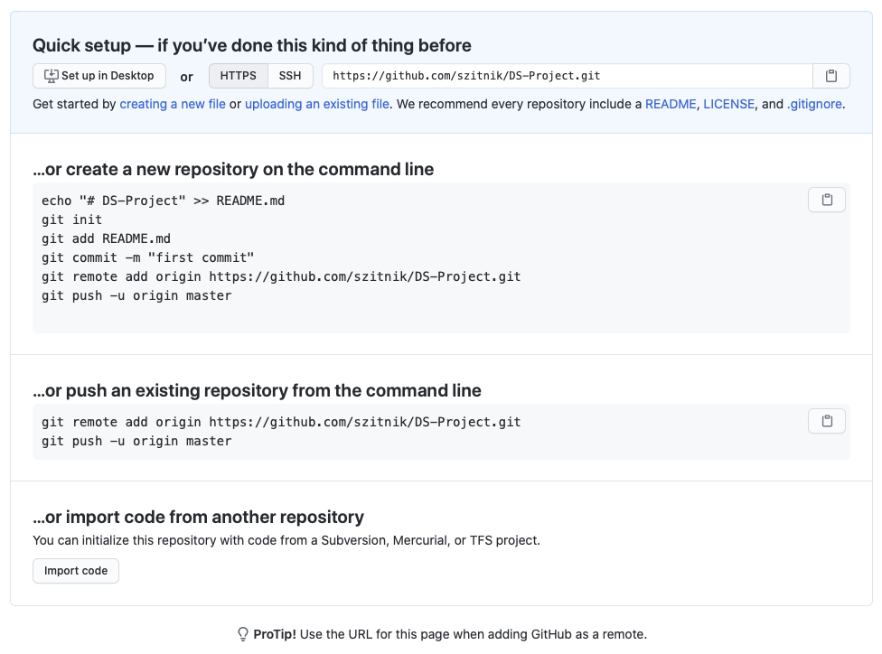

# Source code control {#git}

## Overview

Source code control systems, version control systems or revision control systems are systems that ease software development in groups. Wikipedia defines them as follows:

> A component of software configuration management, version control, also known as revision control, source control, or source code management systems are systems responsible for the management of changes to documents, computer programs, large web sites, and other collections of information. Changes are usually identified by a number or letter code, termed the "revision number", "revision level", or simply "revision". For example, an initial set of files is "revision 1". When the first change is made, the resulting set is "revision 2", and so on. Each revision is associated with a timestamp and the person making the change. Revisions can be compared, restored, and with some types of files, merged.

There exist a number of different source control systems such as [Subversion](https://subversion.apache.org/), [Mercurial](https://www.mercurial-scm.org/), Microsoft Visual SourceSafe, SourceDepot, [Git](https://git-scm.com/), etc.. Currently, the most popular system is Git which is the most widely used modern version control system in the world today. It is the most recognized and popular approach to contribute to a project (open source or commercial) in a distributed and collaborative manner. Beyond distributed version control system, Git has been designed with performance, security and flexibility in mind.

If you are new to Git it is important for you to differentiate between Git and GitHub:

* *Git* is a widely used Version Control System (VCS) that lets you keep track of all the modifications you make to your code. This means that if a new feature is causing any errors, you can easily roll back to a previous version.
* *GitHub* is a widely used platform for version control that uses Git at its core. It lets you host the remote version of your project from where all the collaborators can have access to it. GitHub is like a social platform where you can find a plethora of open-source projects with their codes. All the new and emerging technologies can be found on this platform. You can collaborate on many projects and have discussions on your contributions. There exist also other platforms that enable you hosting of remote Git repositories such as [GitLab](https://about.gitlab.com/) or [BitBucket](https://bitbucket.org/).

## Why should I know about Git

Where people are often working in groups that are small enough they feel comfortable just keeping their code on Dropbox and trying to make sure that collaborators never work on the same file at the same time (in the hope of never changing the same file). But git has much to offer the modern data scientist, even if they only work on small teams and don’t want to contribute to larger software projects. Some major benefits of using git are:

1. *Keep an archive of every version of your project*: Git works by logging the work you do on your project into a series of discrete sets of changes called “commits”. Crucially, it remembers all of your commits, making it possible to easily go back to a previous version of the project any time you want. If you discover that your collaborator deleted part of your code and you did not notice, can easily recover the version of that file that existed before.
2. *All you and your co-authors to work at the same time*: Git treats each line in a text document separately, so if your collaborator is editing the introduction of your paper (assuming it’s in a text format such as LaTeX) while you’re editing the conclusion, git can easily integrate your simultaneous edits. Moreover, if you do both edit the same line of code or text, then git will help you resolve those conflicting edits in a very efficient manner instead of what Dropbox does, and leave you to figure out what changes conflicted and how to integrate both authors’ changes.
3. *You can easily see what changes you’re collaborator has made*: Because git is organized around keeping track of changes (again, called commits), when your collaborator makes changes to a document, git allows you to easily see just the changes your collaborator has made. This makes it much easier for colleagues to be aware of how their project is changing to watch out of problems (e.g. you can easily see if your collaborator recoded a variable in a way that is problematic for code you wrote later). 
4. *Allows you to contribute to open source projects*: This may not be something you’re planning to jump into, but learning git will make this an option. If you find that a package you use doesn’t have a feature you need, the ability to use git will make it possible for you to add that feature to the package, not only allowing you to do what you want to do, but also making that fix available to the broader community.
5. *Allows you to make your project open source so others can contribute to your project*: If you know git, you can also share that code in a way that makes it easy for other people to contribute code and improve that package. Also, being active in the open-source community or showing code of your hobby projects in public source code repositories may help you getting a better job.

## Basic Git terminology


### Repository
_Repository_ or _Repo_ is a folder that contains all the project files and the history of the revisions made to each file. The repo stores its data within a _.git_ hidden folder in your project. It contains all the history related to your repository. In general you will work with at least two repositories throughout the lifetime of your project – _Remote repo_ and _Local repo_:

* _Remote repo_ contains your project that can be accessed from anywhere and by anyone that has access and sufficent rights to the git server (e.g. GitHub). In general you can have multiple remote repositories and push changes selectively to each of them. When you clone a repository for the first time from a remote repo, that remote repo will be named _origin_ and you will be able to push or pull code from it. You can manage connections to the remote repositories using `git remote` commands. 
* _Local repo_ is a copy of the remote repo that resides on your local machine. All the changes you make are saved in your local repo. Your collaborators will not be able to see them until you push them to the remote repo (and after they browse the remote repo or pull the code locally).

### Clone

```{bash, eval=FALSE}
$ git clone <Repo URL>
```

_Cloning_ means creating a copy of the remote repo on your local machine. After that you can make changes to the local copy of the files, commit them to the local repo and publish (i.e. push) commits back to the remote repo.

If you would like to create a new repository locally without cloning an existing one, you can use the `git init` command and an empty repository will be created in you current folder. If you would like to publish your repository remotely, you will need to add a connection to the empty remote Git repository (`git remote` command) and then push commits to it. 

_CAUTION_: You cannot merge two different repositories together. So, when you start the project, only one collaborator needs to create the repository and all others should be using the same one.

### Adding

```{bash, eval=FALSE}
$ git add <filename or folder>
```

By default Git monitors the project folder for changes in files. When you add new files or change existing ones, you need to tell git, which files would you like to include in the next _commit_ using `git add` command. To check which files will already be included or which files are changed from the last repository state, you can use command `git status`.  

### Commit

```{bash, eval=FALSE}
$ git commit -m "<commit message>"
```

When you _commit_ changes, you save the changes you made to files in the repo. The changes will consist only of files you had previously added using _git add_ command and will be saved to your local Git repository. To make changes available to others, you need to send changes to the remote repo using the `push` command.

_HINT_: If your commit would consist of only the files that Git is already tracking (i.e. no new files), you can use command `git commit -a -m "<commit message>"`.

### Push

```{bash, eval=FALSE}
$ git push <remote name> <branch name>
```

_Push_ command allows you to copy all the changes from the remote repo to your local repo. Now all the collaborators will have access to the changes and will be able to update their local repositories. You can sync code with multiple remote repositories which is defined by the first parameter (by default it is named _origin_). The second parameter defines which branch we would like our changes to be copied (by default it is named _master_ - we will cover more about branching in \@ref(git-branching)).

### Pull

```{bash, eval=FALSE}
$ git pull <remote name> <branch name>
```

The _pull_ command is analogous to the push command but is intended to copy changes from the remote repository to the local repository. 

## A beginner Git example

*Step 0:* First we need to install Git. Visit [https://git-scm.com/downloads](https://git-scm.com/downloads),  download the package for your system and install. Depending on your OS, there are exist also many package managers that provide Git. After you install Git, the command should be available in the terminal:

```{bash, eval=FALSE}
$ git
usage: git [--version] [--help] [-C <path>] [-c <name>=<value>]
           [--exec-path[=<path>]] [--html-path] [--man-path] [--info-path]
           [-p | --paginate | -P | --no-pager] [--no-replace-objects] [--bare]
           [--git-dir=<path>] [--work-tree=<path>] [--namespace=<name>]
           <command> [<args>]

....
```

Further in the example we use GitHub and if you wish to use SSH links, you need to generate a local SSH key and add it to your GitHub account as described in [the documentation](https://docs.github.com/en/github/authenticating-to-github/connecting-to-github-with-ssh).

*Step 1:* Let's say you have started with a hobby mini project and wrote a simple script in a file _greeter.py_:

```{python, eval=FALSE}
def main():
  print("Ehlo World!")
  
main()
```

As you are not sure how your project will advance and it contains a piece of intellectural work you would like to save it. You decide to create a Git repository.

*Step 2:* Move to the folder where _greeter.py_ is located and create an empty Git repository using a command `git init`. You can observe that a new hidden folder named .git was created in that directory and this is where your local repository resides.

```{bash, eval=FALSE}
$ git init
Initialized empty Git repository in /Users/slavkoz/Downloads/ds_repo/.git/

$ ls -la
total 8
drwxr-xr-x    4 slavkoz  staff   128 Aug 10 13:34 .
drwxr-xr-x@ 154 slavkoz  staff  4928 Aug 10 13:28 ..
drwxr-xr-x    9 slavkoz  staff   288 Aug 10 13:34 .git
-rw-r--r--    1 slavkoz  staff    44 Aug 10 13:29 greeter.py
```

To check the status of your repo, issue `git status`:

```{bash, eval=FALSE}
$ git status
On branch master

No commits yet

Untracked files:
  (use "git add <file>..." to include in what will be committed)
	greeter.py

nothing added to commit but untracked files present (use "git add" to track)
```

*Step 3:* Let's tell Git to track our _greeter.py_ file and add it to the list for the next commit.

```{bash, eval=FALSE}
$ git add greeter.py

$ git status
On branch master

No commits yet

Changes to be committed:
  (use "git rm --cached <file>..." to unstage)
	new file:   greeter.py
```

Now the current version of the _greeter.py_ is staged for commit and we can add it to our repository.

```{bash, eval=FALSE}
$ git commit -m "Initial version of greeter function."
[master (root-commit) e2f5820] Initial version of greeter function.
 1 file changed, 4 insertions(+)
 create mode 100644 greeter.py
 
$ git status
On branch master
nothing to commit, working tree clean
```

After all the changes are committed we double-check there are no uncommited changes in the project. Also, if we do not provide message parameter (-m) to the _git commit_ command, our default editor is opened to write a commit message - it is obligatory to write a commit message. Commit messages should contain description of changes or issue id we were working on.

*Step 4:* In the greeter script we created a typo, so we change the text "Ehlo World!" to "Hello Data Science!" (We must save file in our text editor so the changes are written to disk!). If we check the status of the repo, we will see our file is changed and all the changed files can be commited directly using `git commit -a -m "..."` command. If we do not use `-a` parameter, we need to first add files to a commit and then issue commit command. 

```{bash, eval=FALSE}
$ git status
On branch master
Changes not staged for commit:
  (use "git add <file>..." to update what will be committed)
  (use "git restore <file>..." to discard changes in working directory)
	modified:   greeter.py

no changes added to commit (use "git add" and/or "git commit -a")

$ git commit -a -m "Hello text update."
[master e597a5d] Hello text update.
 1 file changed, 1 insertion(+), 1 deletion(-)

$ git status
On branch master
nothing to commit, working tree clean
```

*Step 5:* We would like to provide a more personal script, so we change the _greeter.py_ as follows: 

```{python, eval=FALSE}
def main():
  student = input("Please enter your name: ")
  
  print(f"Dear {student}, we are happy to have you in the Data Science track!")
  
main()
```

Again, add the file to stage and commit it to the repo.

```{bash, eval=FALSE}
$ git status
On branch master
Changes not staged for commit:
  (use "git add <file>..." to update what will be committed)
  (use "git restore <file>..." to discard changes in working directory)
	modified:   greeter.py

no changes added to commit (use "git add" and/or "git commit -a")

$ git commit -a -m "Personal update."
[master 29710cc] Personal update.
 1 file changed, 3 insertions(+), 1 deletion(-)

$ git status
On branch master
nothing to commit, working tree clean
```

The _commit_ command returns how many files were changes and  how many lines were added or deleted. Still, it is a good practice to use command _git status_ to be sure we do not forget anything.

*Step 6:* As our project progressed and already has some history,

```{bash, eval=FALSE}
$ git log
commit 29710cc16bcaca476d35456fa7453a4f9b422ea6 (HEAD -> master)
Author: Slavko <slavko@zitnik.si>
Date:   Mon Aug 10 13:56:38 2020 +0200

    Personal update.

commit e597a5d1930af50f5ad5d5a6039e4767b8a8c4b4
Author: Slavko <slavko@zitnik.si>
Date:   Mon Aug 10 13:50:56 2020 +0200

    Hello text update.

commit e2f5820364419fa29a17d84392367b90a14d7214
Author: Slavko <slavko@zitnik.si>
Date:   Mon Aug 10 13:42:35 2020 +0200

    Initial version of greeter function.
```

we can upload our project to GitHub so others can contribute and also our code is safer to be stored somewhere in cloud (in general :)). 

As we can see, each commit is identified using a GUID which can be used to move our repo to a specific commit or refer to it. Git by default includes also a graphical interface `gitk` to visually browse history.


There also exist a number of tools work with Git projects (see \@ref(git-guis)).

To create a remote Git repository on GitHub, create a new [GitHub account](https://github.com) and then create a new public repository, named "DS-Project" (DO NOT select to add README or .gitignore!).


We already have a local repository and the second set of commands is useful for us. The first command adds a link to the remote repository and names it "origin" - we could also use any other name. The second command copies all the changes (three commits) to the remote repository to branch named master (default branch). The parameter _-u_ sets "origin" as the default remote repository, so we can later use commands _git push_/_git pull_ without any parameters.

```{bash, eval=FALSE}
$ git remote add origin https://github.com/szitnik/DS-Project.git

$ git push -u origin master
Enumerating objects: 9, done.
Counting objects: 100% (9/9), done.
Delta compression using up to 4 threads
Compressing objects: 100% (5/5), done.
Writing objects: 100% (9/9), 861 bytes | 861.00 KiB/s, done.
Total 9 (delta 0), reused 0 (delta 0)
To https://github.com/szitnik/DS-Project.git
 * [new branch]      master -> master
Branch 'master' set up to track remote branch 'master' from 'origin'.

$ git status
On branch master
Your branch is up to date with 'origin/master'.

nothing to commit, working tree clean
```

*Step 7:* You can now browse your repository on GitHub (see commits, update security, add description, ...). The public Web site should be accessible at https://github.com/YOUR-GITHUB-USERNAME/DS-Project.

It is nice to include a short description of your project, installation instructions or other useful data to your repository landing page. This is done by creating a README.md file in the root of your project (read more about this in Chapter \@ref(reproducibility)). 

Sometimes you use some programming IDEs or have files with sensitive data (e.g. database passwords) in the project folder but would like to see that Git ignores such files. To ignore such files, create a _.gitignore_ file and add names of files or folders you would like to ignore in each line separately. Commit and push your file to the repo and Git will automatically ignore them (they will not appear in git status listing). Check some examples of ignore files at [https://github.com/github/gitignore](https://github.com/github/gitignore). 

## "Advanced" Git usage

There are many options of how to use git and what operations it allows us, such as developer workflow creation, user rights definition, commits "cherry picking", commits "squashing", etc. In this section we describe only the most common features - conflict resolution, branching and forking.

We continue with our project from the previous section.

### Conflict resolution

Let's say that two developers are now working on a project and we have 3 synced repositories (local repo at dev A, local repo at dev B and public GitHub repo).

The developer B now changes the text in code to "... you in the Data Science track at the University of Maribor!", commits file and pushes it to the remote repo.

*Step 7:* The developer A (i.e. we) changed text in the code to "... you in the Data Science track at the University of Ljubljana!", commits file and tries to push the file to the remote repo (after the developer B):

```{bash, eval=FALSE}
$ git commit -a -m "Uni. Ljubljana added."
[master d263b01] Uni. Ljubljana added.
 1 file changed, 1 insertion(+), 1 deletion(-)

$ git push
To https://github.com/szitnik/DS-Project.git
 ! [rejected]        master -> master (fetch first)
error: failed to push some refs to 'https://github.com/szitnik/DS-Project.git'
hint: Updates were rejected because the remote contains work that you do
hint: not have locally. This is usually caused by another repository pushing
hint: to the same ref. You may want to first integrate the remote changes
hint: (e.g., 'git pull ...') before pushing again.
hint: See the 'Note about fast-forwards' in 'git push --help' for details.
```

The push is rejected as the remote repository contains some more commits before our changes. That is why we need to issue _git pull_ to integrate changes locally and then push them to the remote repo. 

```{bash, eval=FALSE}
$ git pull
remote: Enumerating objects: 5, done.
remote: Counting objects: 100% (5/5), done.
remote: Compressing objects: 100% (2/2), done.
remote: Total 3 (delta 1), reused 0 (delta 0), pack-reused 0
Unpacking objects: 100% (3/3), done.
From https://github.com/szitnik/DS-Project
   29710cc..11483e3  master     -> origin/master
Auto-merging greeter.py
CONFLICT (content): Merge conflict in greeter.py
Automatic merge failed; fix conflicts and then commit the result.
```

If developers have worked on separate functions, the changes would be automatically merged. In this case they were working on the same line and Git cannot automatically merge the code. That is why we need to do this manually in _greeter.py_ file:


In the conflicted file we are presented both conflicting changes. To resolve the conflict we need to remove lines added by Git and keep the final code (i.e. ours code). After that we create a commit with merged changes and try to push again.

```{bash, eval=FALSE}
# Manually resolve conflict
$ nano greeter.py 

$ git commit -a -m "Merged changes."
[master e6deaf6] Merged changes.

$ git push
Enumerating objects: 10, done.
Counting objects: 100% (10/10), done.
Delta compression using up to 4 threads
Compressing objects: 100% (4/4), done.
Writing objects: 100% (6/6), 547 bytes | 547.00 KiB/s, done.
Total 6 (delta 2), reused 0 (delta 0)
remote: Resolving deltas: 100% (2/2), completed with 1 local object.
To https://github.com/szitnik/DS-Project.git
   11483e3..e6deaf6  master -> master
```

Git includes tool `git mergetool` which eases conflict resolution as a developer just selects which lines to include in a final decision. Also, full-featured Git tools (section \@ref(git-guis)) mostly provide mechanisms to deal with conflict resolutions easily.

### Branching {#git-branching}

We have already mentioned that the default branch in a git repository is a branch named "master". When working on a larger project we would like to have the stable code always accessible and separate from the code in the development. Git branches allows us to create "multiple repositories" in a Git repository. Therefore we can have a master branch with the tested code and available to download and other branches which are based on a master branch and contain new features in development.


*Step 8:* Let's say our project is mature and many people use daily. We would like to add additional parameters to the program and when we finish and are satisfied with the solution, we merge it to master.

First, we need to create a new branch using a command `git branch <branch-name>`. The command without the parameter lists branches in the local repo and shows which branch is currently active.

```{bash, eval=FALSE}
$ git branch parameters-addition

$ git branch
* master
  parameters-addition

$ git checkout parameters-addition
Switched to branch 'parameters-addition'

$ git branch
  master
* parameters-addition
```

Everything we do with Git is done locally. To make this branch available to others, we need to upload it to remote repo using command `git push origin parameters-addition` and then also regularly push commits.

As we are now in a new branch, we update the _greeter.py_ code as follows:

```{python, eval=FALSE}
def main():
  print("###################################\nSTUDENT ENROLLMENT FORM\n###################################")

  student = input("Please enter your name: ")
  uni = input("Please enter your University name: ")
  track = input("Please enter your study programme: ")
  
  print(f"Dear {student}, we are happy to have you in the {track} track at the {uni}!")
  
main()
```

Then we commit the change and push it to the remote repo. The testers can now test the code and then we decide to merge changes into master to make it available for our users.

We move back to the master branch (our changes above are not available there) using command `git checkout <branch-name>`. Now we can merge the "parameters-addition" branch to master using `git merge <branch name> -m "message"` command.

```{bash, eval=FALSE}
$ git checkout master
Switched to branch 'master'
Your branch is up to date with 'origin/master'.

$ git merge parameters-addition -m "Track and uni parameters feature added"
Updating e6deaf6..7983f71
Fast-forward (no commit created; -m option ignored)
 greeter.py | 6 +++++-
 1 file changed, 5 insertions(+), 1 deletion(-)
```

If there would be other changes made on master while we were developing new features, they would be merged together. In case of conflict we would need to resolve it using the same procedure as described in the previous section. 

_HINT_: Before merging to a main branch we advise to first (A) merge main branch into a feature branch, (B) resolve conflicts, (C) test and then (D) merge into the main branch. Command `git log` and graphical-based tools implement nice visualizations of connections between branches.

### Forking

Forking is not a Git feature but a feature platforms like GitHub offer to the developers. Let's say a korean developer finds our repository and would like to translate our project and then publish his addition to our repository. _Forking_ enables him to create a separate clone of our repository under his username. Then he has all the rights to do anything with that new repository without affecting ours. After he translated the project and would like to publish his code in our repository as many people are already using it and it is being actively developed. He can send us a _pull request_ and we can review his changes. We can ask him to improve the code, reject or accept his changes. 

*Step 9:* Let's say there exist a korean developer interested in our app and he forks our repo on GitHub.


Then he implements additional features and creates us a pull request.


We are notified about his pull request and can review it. We do not speak Korean but the change seems legit so we accept the change.


[Our repository](https://github.com/szitnik/DS-Project) is now updated with korean changes. 


## GUI Programs {#git-guis}

There exist Git client tools for various operating systems (e.g. GitKraken, SourceTree, Tower). Some IDEs have also integrated git functionalities (e.g. VS Code, IntelliJ IDEs). Still, we advise you to use Git commands manually at least at the beginning. In that case you will be in control of your code and then be able to easily 1transition between different GUI tools if needed.

## Further reading and references

* Official Git source with extensive documentation: [git-scm](https://git-scm.com). They provide a book - [Pro Git which is also freely available](https://git-scm.com/book/en).

* Git tutorials along with more advanced topics such as Git large file storage: [Atlassian Git](https://www.atlassian.com/git). 

* There exist lots of online resources and courses to practice Git, such as [A beginners guide](https://www.analyticsvidhya.com/blog/2020/05/git-github-essential-guide-beginners) blog post.

## Learning outcomes

Data science students should work towards obtaining the knowledge and the skills that enable them to:

* Create their own Git repositories, collaborate in groups and publish their code.
* Search for useful data science projects, submit issues, create forks and pull requests.

## Practice problems

1. Think of a large data science project and organization of a Git repository. Create a repository and set up multiple branches, define security roles for them, enable Git LFS, ... Search for Git workflows and best practices that are used by larger teams. 

2. Create a fork of this repository, repair errors, clean the structure and submit a pull request to the maintainers. 
 
