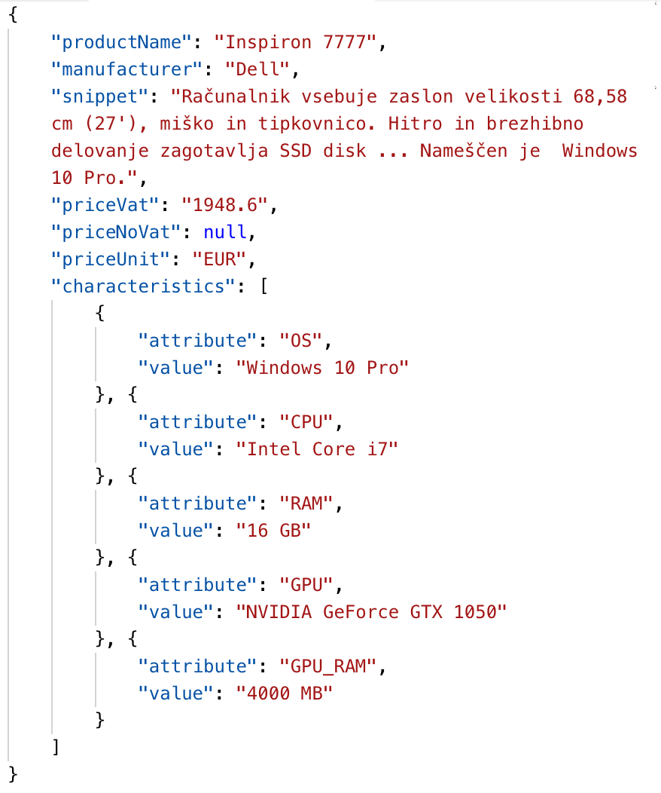
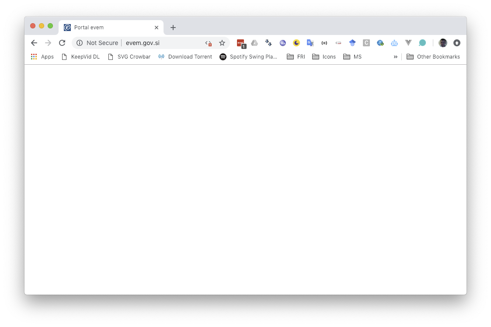
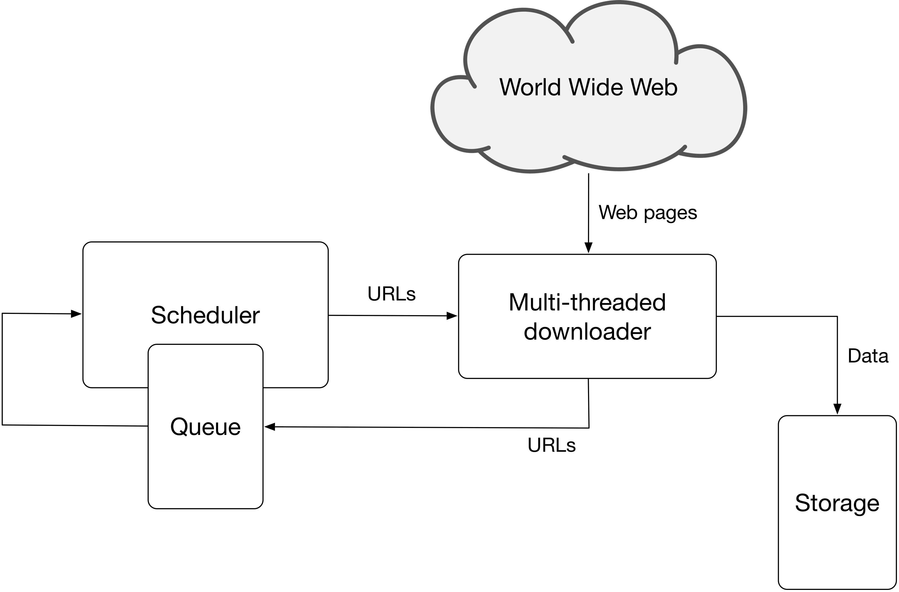

# Web scraping

Nowadays there exist more than **3.7 billion Internet users**, which is nearly around **50% of the whole World population** [@InternetWorldStats]. Taking into account all the existing Internet-enabled devices, we may believe approximatelly 30 billion devices are connected into the network [@deitel2011].

A large part of Web information extraction requires the knowledge of natural language processing techniques such as text pre-processing, information extraction (entity extraction, relationship extraction, coreference resolution), sentiment analysis, text categorization/classification, language models and others. These techniques are covered by the elective Natural language processing course. For introduction to natural language techniques please see the proposed literature [@liu2011] (Chapter 11), [@manning2008] (Chapters 12, 13, 15-17, 20), [@aggarwal2012] (Chapters 1-8, 12-14) or other specialized books on natural language processing. In this part we therefore focus only on Web data extraction (aka. Web scraping). Its main goal is to automatically extract data from Web sites and store it in a structured format.

## Introduction to Web data extraction

Web data extraction systems [@ferrara2014] are a broad class of software applications targeting at extracting data from Web sources. A Web data extraction system usually interacts with a Web source and extracts data stored in it: for instance, if the source is an HTML Web page, the extracted content could consist of elements in the page as well as the full-text of the page itself. Eventually, extracted data might be post-processed, converted in the most convenient structured format and stored for further usage. The design and implementation of Web data extraction systems has been discussed from different perspectives and it leverages on scientific methods coming from various disciplines including machine learning, logic and natural language processing.

Web data extraction systems find extensive use in a wide range of applications including the analysis of text-based documents available to a company (like e-mails, support forums, technical and legal documentation, and so on), Business and Competitive Intelligence, crawling of Social Web platforms, BioInformatics and so on. The importance of Web data extraction systems depends on the fact that a large (and steadily growing) amount of data is continuously produced, shared and consumed online: Web data extraction systems allow to efficiently collect these data with limited human effort. The availability and analysis of collected data is an indefeasible requirement to understand complex social, scientific and economic phenomena which generate the data. For example, collecting digital traces produced by users of social Web platforms such as Facebook, YouTube or Flickr is the key step to understand, model and predict human behavior.

In the commercial field, the Web provides a wealth of public domain information. A company can probe the Web to acquire and analyze information about the activity of its competitors. This process is known as Competitive Intelligence and it is crucial to quickly identify the opportunities provided by the market, to anticipate the decisions of the competitors as well as to learn from their faults and successes.

In its most general formulation, the problem of extracting data from the Web is hard because it is constrained by several requirements. The key challenges we can encounter in the design of a Web Data Extraction system can be summarized as follows:

* Web data extraction techniques implemented in a Web data extraction system often require the help of human experts. A first challenge consists of providing a high degree of automation by reducing human efforts as much as possible. Human feedback, however, may play an important role in raising the level of accuracy achieved by a Web data extraction system. A related challenge is to identify a reasonable tradeoff between the need of building highly automated Web data extraction procedures and the requirement of achieving accurate performance.
* Web data extraction techniques should be able to process large volumes of data in relatively short time. This requirement is particularly stringent in the field of Business and Competitive Intelligence because a company needs to perform timely analysis of market conditions.
* Applications in the field of Social Web or, more in general, those dealing with personal data must provide solid privacy guarantees. Therefore, potential (even if unintentional) attempts to violate user privacy should be timely and adequately identified and counteracted.
* Approaches relying on machine learning often require a significantly large training set of manually labeled Web pages. In general, the task of labeling pages is time-expensive and error-prone and, therefore, in many cases we cannot assume the existence of labeled pages.
* Oftentimes, a Web data extraction tool has to routinely extract data from a Web Data source which can evolve over time. Web sources are continuously evolving and structural changes happen with no forewarning, thus are unpredictable. Eventually, in real-world scenarios it emerges the need of maintaining these systems, that might stop working correctly if lacking of flexibility to detect and face structural modifications of related Web sources.

The first attempts to extract data from the Web are dated back in early nineties. In the early days, this discipline borrowed approaches and techniques from Information Extraction (IE) literature. In particular, two classes of strategies emerged: *learning techniques* and *knowledge engineering techniques* – also called *learning-based* and *rule-based approaches*, respectively. These classes share a common rationale: the former was thought to develop systems that require human expertise to define rules (for example, *regular expressions*) to successfully accomplish the data extraction. These approaches require specific domain expertise: users that design and implement the rules and train the system must have programming experience and a good knowledge of the domain in which the data extraction system will operate; they will also have the ability to envisage potential usage scenarios and tasks assigned to the system. On the other hand, also some approaches of the latter class involve strong familiarity with both the requirements and the functions of the platform, so the human engagement is essential.

## Web wrapper

In the literature, any procedure that aims at extracting structured data from unstructured (or semi-structured) data sources is usually referred to as a wrapper. In the context of Web data extraction we provide the following definition:

> **Web wrapper** is a procedure, that might implement one or many different classes of algorithms, which seeks and finds data required by a human user, extracting them from unstructured (or semi-structured) Web sources, and transforming them into structured data, merging and unifying this information for further processing, in a semi-automatic or fully automatic way.

Web wrappers are characterized by a life-cycle constituted by several steps:

1. *Wrapper generation*: the wrapper is defined and implemented according to one or more selected techniques.
2. *Wrapper execution*: the wrapper runs and extracts data continuously.
3. *Wrapper maintenance*: the structure of data sources may change and the wrapper should be adapted accordingly to keep working properly.

In particular, the first two steps of a wrapper life-cycle, generation and execution, might be implemented manually, for example by defining and executing regular expressions over the HTML documents. Alternatively, which is the aim of Web data extraction systems, wrappers might be defined and executed by using an inductive approach – a process commonly known as wrapper induction [@kushmerick1997]. Web wrapper induction is challenging because it requires high level automation strategies. There exist also hybrid approaches that make possible for users to generate and run wrappers semi-automatically by means of visual interfaces.

The last step of a wrapper life-cycle is the maintenance: Web pages change their structure continuously and without forewarning. This might corrupt the correct functioning of a Web wrapper, whose definition is usually tightly bound to the structure of the Web pages adopted for its generation. Defining automatic strategies for wrapper maintenance is of outstanding importance to guarantee correctness of extracted data and robustness of Web data extraction platforms. The wrapper maintenance is especially important for long-term extractions. For the purposes of data-science needs, wrappers are mostly run over a short period of time, while there normally no changes are made to a Web site and therefore automatic adaptations are not needed.

### HTML DOM

HTML is the predominant language for implementing Web pages and it is largely supported by World Wide Web consortium. HTML pages can be regarded as a form of semi-structured data (even if less structured than other sources like XML documents) in which information follows a nested structure; HTML features can be profitably used in the design of suitable wrappers. However, we acknowledge that a large amount of semi-structured information is present in non-HTML formats (think of e-mail messages, software code and related documentations, system logs and so on) but the research approaches targeting at extracting information from this type of sources are the focus of general information extraction.

The backbone of a Web page is a Hypertext Markup Language (HTML) document which consists of HTML tags. According to the [Document Object Model](http://www.w3.org/DOM) (DOM), every HTML tag is an object. Nested tags are called children of the enclosing tag. Generally we first parse a web page into a DOM  tree representation. Then we specify extraction patterns as paths from the root of the DOM tree to the node containing the values to extract. Special languages such as XPath or XQuery support searching and querying elements of a DOM tree.

Below we show a simple HTML Web page and it's representation as a HTML DOM tree.

```html
<html>
  <head>
    <title>My Title</title>
  </head>
  <body>
    <a href="">My link</a>
    <h1>My header</h1>
  </body>
</html>
```

```{r htmlDOM, echo=FALSE, fig.align="center", fig.cap="DOM tree representation of the above HTML Web page."}
knitr::include_graphics("data/WebDataExtraction/HTML_DOM.png")
```

The HTML DOM is an Object Model for HTML and it defines:

* HTML elements as objects.
* Properties for all HTML elements.
* Methods for all HTML elements.
* Events for all HTML elements.

Interactive Web pages mostly consist of "shor programs" written in Javascript which is executed directly in the Web browser. The HTML DOM is also an API (Programming Interface) for JavaScript that allows it to dynamically:

* Add/change/remove HTML elements/attributes/events.
* Add/change/remove CSS styles.
* React to HTML events.

### XPath

One of the main advantage of the adoption of the Document Object Model for Web Content Extraction is the possibility of exploiting some tools typical of XML languages (and HTML is to all effects a dialect of the XML). In particular, the XML Path Language (XPath) provides with a powerful syntax to address specific elements of an XML document (and, to the same extent, of HTML Web pages) in a simple manner. XPath has been defined by the World Wide Web consortium, so as DOM.

Below we provide an XML example to explain how XPath can be used to address elements of a Web page.

```html
<persons>
  <person>
    <name>John</name>
    <height unit=”cm”>191</height>
    <sport>Running</sport>
    <sport>Cycling</sport>
  </person>
  <person>
    <name>Mandy</name>
    <height>140</height>
   <sport>Swimming</sport>
  </person>
</persons>
```

There exist two possible ways to use XPath: (A) to identify a single element in the document tree, or (B) to address multiple occurrences of elements. We show some XPath queries against the above XML document:

* `/persons/person/name` - Extract all elements in the provided path. The result is `<name>John</name>` and `<name>Mandy</name>`.
* `/persons/person/name/text()` - Get contents of all the elements that match the provided path. The result is `John` and `Mandy`.
* `//person/height[@unit="cm"]/text()` - Extract contents of all *height* objects that have set attribute *unit* to *cm* and have their parent element named as *person*. Result is `191`.
* `//sport` - Extract all elements that appear at any level of XML and are named *sport*. The result is `<sport>Running</sport>`, `<sport>Cycling</sport>` and `<sport>Swimming</sport>`. 
* `//person[name="Mandy"]/sport/text()` - Extract contents of *sport* objects that are nested directly under *person* objects which contain a *name* object with value *Mandy*. The result is `Swimming`.

The adoption of XPath as the tool to address elements in Web page has been largely exploited in the literature. The major weakness of XPath is related to its lack of flexibility: each XPath expression is strictly related to the structure of the Web page on top of which it has been defined. However, this limitation has been partially mitigated, by introducing relative path expressions, in latest releases. In general, even minor changes to the structure of a Web page might corrupt the correct functioning of an XPath expression defined on a previous version of the page. Still, due to the ease of use, many Web extraction libraries support the use of XPath in to addition of their own extraction API.

Let us consider Web pages generated by a script (e.g. the information about a book in an e-commerce Web site). Now assume that the script undergoes some change. We can expect that the tree structure of the HTML page generated by that script will change accordingly. To keep the Web data extraction process functional, we should update the expression every time any change occurs to the underlying page generation model. Such an operation would require a high human commitment and, therefore, its cost could be prohibitively large. To this purpose, a concept of *wrapper robustness* was introduced. From the perspective of XPath the idea is to find, among all the XPath expressions capable of extracting the same information from a Web page, the one that is less influenced by potential changes in the structure of the page and such an expression identifies the more robust wrapper. In general, to make the whole Web data extraction process robust, we need suitable tools allowing us to measure the similarity degree of two documents. Such a task can be accomplished by detecting structural variations in the DOM trees associated with the documents. To this extent, some techniques, called tree-matching strategies are a good candidate to detect similarities between two trees. We do not discuss about these techniques as they are more thoroughly covered in the Web extraction and information retrieval course.

### Modern Web sites and JS frameworks

Modern Web sites still use HTML to render their data within Web browsers. Below we show an example of a Web page (left side) and extracted content from it (right side). When all the pages to extract data from follow the same structure, we can easily use techniques mentioned above to extract all the needed data.

<table class="additionalSources">
<tr>
<td><center><b>e-Commerce Web page - product description</b></center></td>
<td><center><b>Extracted data in a structured format (JSON)</b></center></td>
</tr>
<tr>
<td></td>
<td></td>
</tr>
</table>

In the last years Web pages became more dynamic, load data in the background, do not refresh the whole view, etc. All these functionalities require dynamic code to be executed direcly on the client - that is inside the Web browser. The main language that can be interpreted by a Web browser is Javascript. Although best practices instruct the programmers to support non-Javascript browsers, there are many Web pages that malfunction if the browser does not support Javascript. With the advent of Single page application (SPA) Web sites the content does not even partially load as the whole Web page is driven by the Javascript. Popular frameworks that enable SPA development are for example [Angular](https://angular.io/), [Vue.js](https://vuejs.org/) or [React](https://reactjs.org/). Below we show some examples of rendering Web pages when a browser runs with Javascript enabled or disabled:

<table class="additionalSources">
<tr>
<td><center><b>Javascript enabled</b></center></td>
<td><center><b>Javascript disabled</b></center></td>
</tr>
<tr>
<td></td>
<td></td>
</tr>
<tr>
<td></td>
<td></td>
</tr>
</table>

When we develop a Web extraction system we should first review how the target Web sites is built and which frontend technologies it uses. Then we can also more efficiently use a library to implement a final Web wrapper to extract the desired data. When we need to execute Javascript, our extraction library needs to implement *headless browser* functionality. This functionality runs a hidden browser to construct a final HTML content which is then used for further manipulation. Libraries that support such functionality are for example:

* [Selenium](https://www.seleniumhq.org/)
* [phantomJS](http://phantomjs.org/)
* [HTMLUnit](http://htmlunit.sourceforge.net/)

Running a headless browser and executing Javascript can take long time and may not be very prone to errors. So if we know that our data can be extracted, we should rather use just an HTML parsing library. There exist many of suc libraries and we mention just some of them: 

  * [HTML Cleaner](http://htmlcleaner.sourceforge.net/)
  * [HTML Parser](http://htmlparser.sourceforge.net/)
  * [JSoup](https://jsoup.org/) (Java) or [BeautifulSoup](https://www.crummy.com/software/BeautifulSoup/) (Python)
  * [Jaunt API](https://jaunt-api.com/)
  * [HTTP Client](http://hc.apache.org/)

### Crawling, resources and policies

Crawling is a process of automatic navigation among Web pages within defined Web sites. When we deal with continuous retrieval of content from a large amount of Web pages, there are many aspects we need to take care of. For example, (A) we need to track which pages were already visited, (B) we need to decide how to handle HTTP redirects or HTTP error codes in case of a delayed retry, (C) we must follow the rules written in *robots.txt* for each domain or should follow general crawling ethics so that we not send too many request to a specific server, (D) we need to track changes on Web pages to identify approximate change-rate, etc.

Generally, a crawler architecture will consist of the following components (Figure \@ref(fig:crawlerArchitecture)):

* HTTP downloader and renderer: To retrieve and render a web page.
* Data extractor: Minimal functionalities to extract images and hyperlinks.
* Duplicate detector: To detect already parsed pages.
* URL frontier: A list of URLs waiting to be parsed.
* Datastore: To store the data and additional metadata used by the crawler.

```{r crawlerArchitecture, echo=FALSE, fig.align="center", fig.cap="Web crawler architecture."}

```

As we already mentioned before, we need to understand all the specifics how Web pages are built and generated. To make sure that we correctly gather all the needed content placed into the DOM by Javascript, you should use headless browsers. Google's crawler - Googlebot implements this as a two-step process or expects to retrieve dynamically built web page from an HTTP server. A nice session on crawling modern web sites built using JS frameworks, link parsing and image indexing was a part of Google IO 2018 and it is suggested for you to view it to get a rough impression of problems that can appear:

<center><iframe width="560" height="315" src="https://www.youtube.com/embed/PFwUbgvpdaQ" frameborder="0" allow="accelerometer; autoplay; encrypted-media; gyroscope; picture-in-picture" allowfullscreen></iframe></center>

Also, when we retrieve all the needed Web page content, the next steps include data cleaning, data integration, etc. in order to prepare data for further data science analysis. 

Sometimes we can decide to design our own small crawler but we must be aware of many aspects to be taken care of to efficiently retrieve the needed content. For example, a crawler needs to identify links to follow them which can be encoded in different ways. They can be explicityl given within *href* attributes, *onclick* Javascript events (e.g. *location.href* or *document.location*), etc. Similarly, images can be generated in different formats, shown dynamically, ... In order to cover the most common scenarios we propose to use a crawler package or suite that will help us retrieve the pages we need. Some examples of crawler libraries or standalone crawlers are the following:

* [Scrapy](https://scrapy.org/),
* [Apache Nutch](https://nutch.apache.org/),
* [crawler4j](https://github.com/yasserg/crawler4j),
* [gecco](https://github.com/xtuhcy/gecco),
* [Norconex HTTP Collector](https://www.norconex.com/collectors/collector-http/),
* [webmagic](https://github.com/code4craft/webmagic),
* [Webmuncher](https://github.com/dadepo/Webmuncher).

Apart from web pages only, the Web consists also of other files that web pages point to, for example PDF files, Word/OpenOffice documents, Excel spreadsheets, presentations, etc. They may also include some relevant information for us. Therefore we propose to use special libraries to parse these kinds of files:

* [Apache Tika](https://tika.apache.org/) toolkit detects and extracts metadata and text from over a thousand different file types (such as PPT, XLS, and PDF). All of these file types can be parsed through a single interface, making Tika useful for search engine indexing, content analysis, translation, and much more.
* [Apache Poi](https://poi.apache.org/) focus on manipulating various file formats based upon the Office Open XML standards (OOXML) and Microsoft's OLE 2 Compound Document format (OLE2). In short, you can read and write MS Excel files using Java.
* [Apache PDFBox](https://pdfbox.apache.org/) library is an open source Java tool for working with PDF documents. This project allows creation of new PDF documents, manipulation of existing documents and the ability to extract content from documents. It also includes several command-line utilities. 


## Further reading and references

* [Practical Web Scraping for Data Science, Best Practices and Examples with Python (2018), Seppe vanden Broucke and Bart Baesens.](https://www.apress.com/gp/book/9781484235812)
* [Web Scraping with Python (2015), Ryan Mitchell](https://www.amazon.de/Web-Scraping-Python-Ryan-Mitchell/dp/1491910291)
* [Web Data Mining: Exploring Hyperlinks, Contents, and Usage Data. 2nd ed. (2011), Bing Liu](https://www.amazon.com/Web-Data-Mining-Data-Centric-Applications/dp/3642194591)
* Check also related Faculty's bachelor or master theses: [Vmesnik za dostop do portala odprtih podatkov Slovenije (2018), Sašo Marić](https://plus.si.cobiss.net/opac7/bib/fkkri/1537726403), [Analiza dimenzij kakovosti informacij spletnih strani slovenskih podjetij (2016), Matic Jazbec](https://plus.si.cobiss.net/opac7/bib/fkkri/1537211331), [Zajem in obdelava podatkov s spleta (2015), Marko Balažic](https://plus.si.cobiss.net/opac7/bib/fkkri/1536570819), [Napredno iskanje nepremičnin (2014), Nina Žakelj](https://plus.si.cobiss.net/opac7/bib/fkkri/10715988), [Tehnike spletnega luščenja podatkov (2013), Peter Grlica](https://plus.si.cobiss.net/opac7/bib/fkkri/9990484), [Spletni iskalnik podatkov o osebah (2013), Matej Žniderič](https://plus.si.cobiss.net/opac7/bib/fkkri/10152276), [Delno samodejna izdelava ovojnic za spletne vire (2012), Rok Burgar](https://plus.si.cobiss.net/opac7/bib/fkkri/9454420), etc.

## Learning outcomes

Data science students should work towards obtaining the knowledge and the skills that enable them to:

* Understand the architecture and different tecchnologies used in the WWW.
* Use or build a standalone Web crawler to gather all the needed data.
* Identify and automatically extract the needed portions of Web page contents.

## Practice problems

* Explore the Web and find some dynamic Web sites. Using your favourite browser inspect the structure of specific Web pages and try to load the same Web pages with disabled Javascript rendering.
* Review all your projects you are working on and search the Web to identify Web sites with relevant information that could enrich your project's data. Build and run a focused crawler. After that clean and export data in your preferred format (JSON or XML).
* An example project: Build a general crawler that will crawl the Web and retrieve the data about primary schools (or high schools) in Spain (or in USA or Germany). Implement a custom wrapper that will extract school name, contact e-mail and school address.


