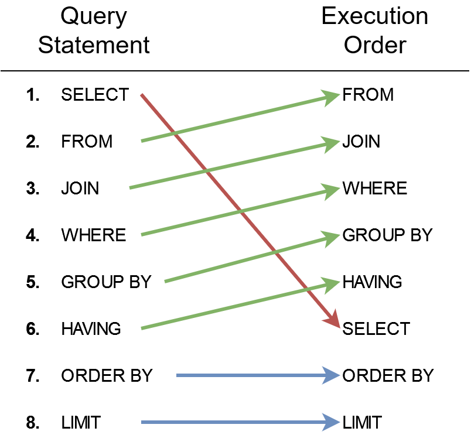

## Chinook Database

### Data Model

The Chinook data model represents a digital media store, including tables for artists, albums, media tracks, invoices and customers.


The Chinook sample database contains 11 tables, as follows:

- `Employee` table stores employee data such as id, last name, first name, etc. It also has a field named ReportsTo to specify who reports to whom.
- `Customer` table stores customer data.
- `Invoice` & invoice_items tables: these two tables store invoice data. The invoices table stores invoice header data and the invoice_items table stores the invoice line items data.
- `Artist` table stores artist data. It is a simple table that contains the id and name.
- `Album` table stores data about a list of tracks. Each album belongs to one artist, but an artist may have multiple albums.
- `Media_type` table stores media types such as MPEG audio and AAC audio files.
- genres table stores music types such as rock, jazz, metal, etc.
- `Track` table stores the data of songs. Each track belongs to one album.
- `Playlists` & playlist_track tables: playlists table stores data about playlists. Each playlist contains a list of tracks. Each track may belong to multiple playlists. The relationship between the playlists and tracks tables is many-to-many. The playlist_track table is used to reflect this relationship.

## Structure of a SQL query

```SQL
SELECT ar.Name AS ArtistName
    , COUNT(al.AlbumId) AS AlbumCount       -- Specifies the columns (fields) you want to retrieve.
FROM Artist ar                              -- Specifies the table you want to retrieve data from.                          
JOIN Album al ON ar.ArtistId = al.ArtistId  -- Specifies the conditions to join the tables.
WHERE ar.Name LIKE 'The%'                   -- Specifies the conditions to filter the rows.
GROUP BY ar.ArtistId                        -- Specifies the grouping columns.
HAVING COUNT(al.AlbumId) > 2                -- Specifies the conditions to filter the groups.
ORDER BY AlbumCount DESC                    -- Specifies the order of the result set.
;
```

## SQL Query Examples

- Retrieve all columns from the Artist table
```SQL
SELECT *
FROM Artist;
```

- Retrieve all albums, that start with the string 'The'
```SQL
SELECT *
FROM Album
WHERE Title LIKE 'The%';
```

- Retrieve all album titles along with the name of their corresponding artist
```SQL
SELECT Album.Title AS AlbumTitle, Artist.Name AS ArtistName
FROM Album
JOIN Artist ON Album.ArtistId = Artist.ArtistId;
```

- Left join example
```SQL
SELECT *
FROM Artist
LEFT JOIN Album ON Artist.ArtistId = Album.ArtistId
ORDER BY Name
```

- Count the number of albums for each artist
```SQL
SELECT Artist.Name AS ArtistName
    , COUNT(Album.AlbumId) AS AlbumCount
FROM Artist
JOIN Album ON Artist.ArtistId = Album.ArtistId
GROUP BY Artist.ArtistId
``` 

- Show the top 3 albums with the most tracks
```SQL
SELECT Album.Title AS AlbumTitle
    , COUNT(Track.TrackId) AS TrackCount
FROM Album
JOIN Track ON Album.AlbumId = Track.AlbumId
JOIN Artist ON Album.ArtistId = Artist.ArtistId
GROUP BY Album.AlbumId
ORDER BY TrackCount DESC
LIMIT 3;
```

- Retrieve the names of all tracks that belong to genres that have more than 50 tracks in the database.
```SQL
SELECT Track.Name AS TrackTitle, Genre.Name AS GenreName
FROM Track
JOIN Genre ON Track.GenreId = Genre.GenreId
WHERE Track.GenreId IN (
    SELECT GenreId
    FROM Track
    GROUP BY GenreId
    HAVING COUNT(TrackId) > 50
);
```

Now we will do the same with a CTE
    
```SQL
WITH GenreTrackCounts AS (
    SELECT Genre.Name AS GenreName
		,Genre.GenreId
		, COUNT(Track.TrackId) AS TrackCount
    FROM Genre
    JOIN Track ON Genre.GenreId = Track.GenreId
    GROUP BY Genre.GenreId
    HAVING TrackCount > 50
)
SELECT Track.Name AS TrackTitle, Genre.Name AS GenreName
FROM Track
JOIN Genre ON Track.GenreId = Genre.GenreId
JOIN GenreTrackCounts ON Genre.GenreId = GenreTrackCounts.GenreId;
```


- CTE example: Find the top 3 genres with the most tracks and display their names along with the number of tracks.
  A Common Table Expression (CTE) is a temporary result set that you can reference within a SQL query. It improves readability and is particularly useful for breaking complex queries into smaller, manageable parts.

```SQL
WITH GenreTrackCounts AS (
    SELECT Genre.Name AS GenreName, COUNT(Track.TrackId) AS TrackCount
    FROM Genre
    JOIN Track ON Genre.GenreId = Track.GenreId
    GROUP BY Genre.GenreId
)
SELECT GenreName, TrackCount
FROM GenreTrackCounts
ORDER BY TrackCount DESC
LIMIT 3;
```

### SQL Order of Execution

SQL queries follow a specific order of execution, which is not the same as the order in which the query is written.



### Connect to a PostgreSQL database

First, we need to setup a PostgreSQL database using Docker. Run the following command to start a PostgreSQL container:

```bash
docker run --name chinook-postgres -e POSTGRES_PASSWORD=postgres -d -p 5432:5432 postgres
```
Running this command will start a PostgreSQL container named chinook-postgres with the password postgres. The container will be accessible on port 5432. Postgres also creates a default database and user named `postgres`.
We added an environment variable `POSTGRES_PASSWORD` to set the password for the `postgres` user.

Next, we can restore the Chinook database to the PostgreSQL container using the following command:
`docker exec -i <CONTAINER> psql -U <USER> -d <DB-NAME> < <PATH-TO-DUMP>`

```bash
docker exec -i chinook-postgres psql -U postgres -d postgres < Chinook_PostgreSql.sql
```
The docker exec command allows you to run a specific command inside an already running Docker container. The command creates a new database named `chinook` and restores the data from the Chinook_PostgreSql.sql file.

Lets see the tables in the database
```bash
docker exec -it chinook-postgres psql -U postgres -d chinook

\dt
```


Now, let's connect to the PostgreSQL database using Python:

```python
import psycopg2

# Connect to the PostgreSQL database
conn = psycopg2.connect(
    dbname="chinook",
    user="postgres",
    password="postgres",
    host="localhost",
    port="5432"
)

# Create a cursor object using the cursor() method
cursor = conn.cursor()

# List all tables in the public schema
cursor.execute("SELECT table_name FROM information_schema.tables WHERE table_schema = 'public';")
print(cursor.fetchall())
```