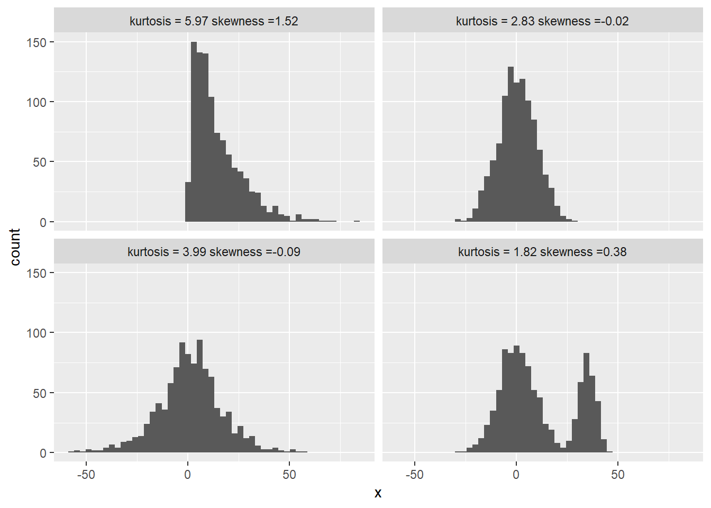
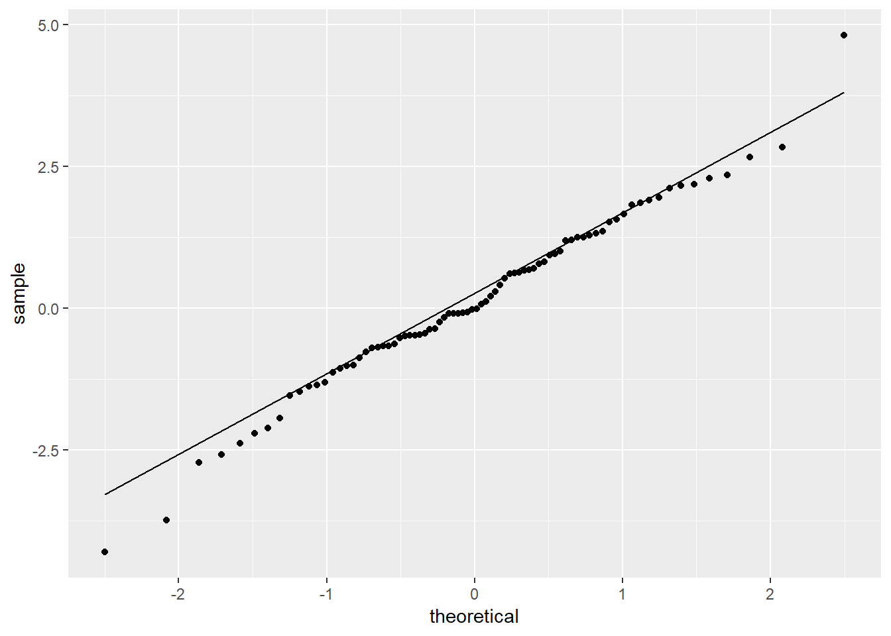
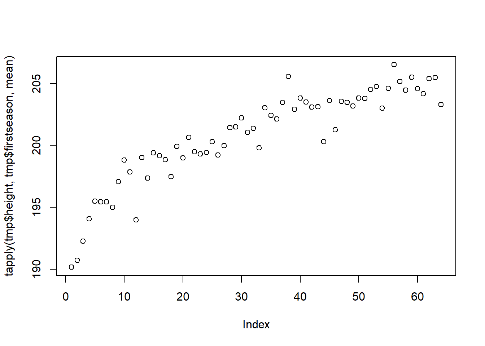
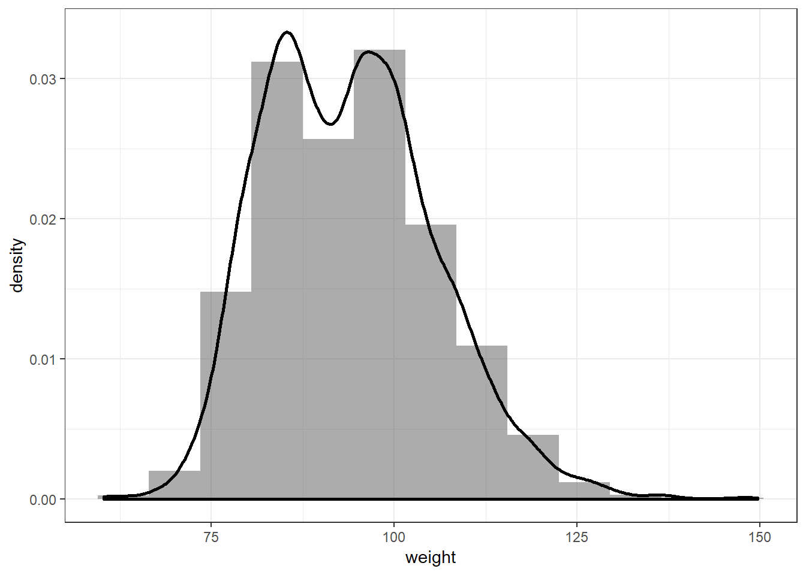
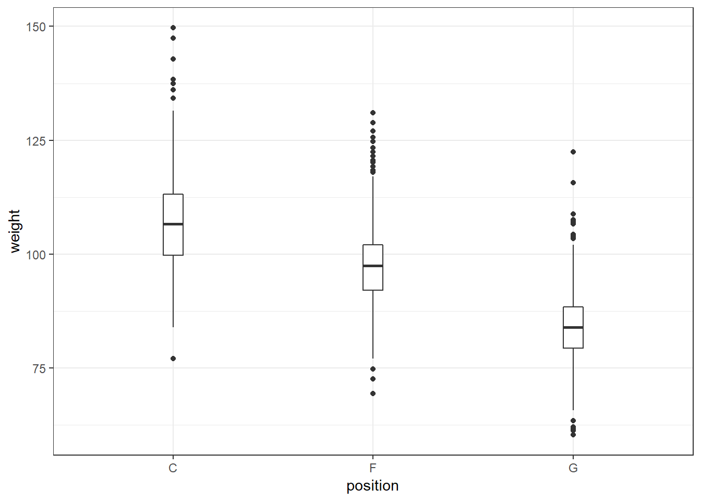
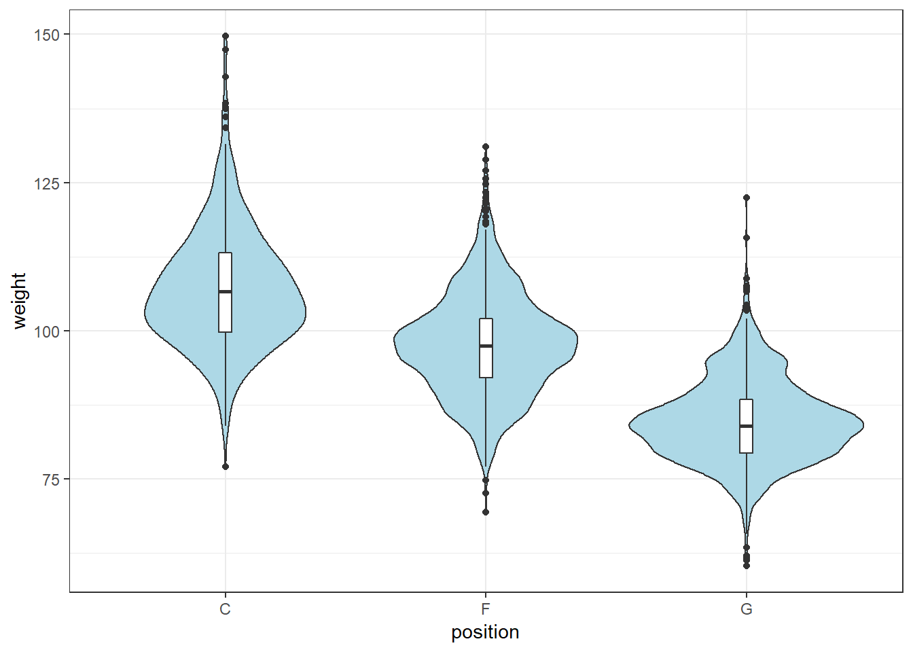
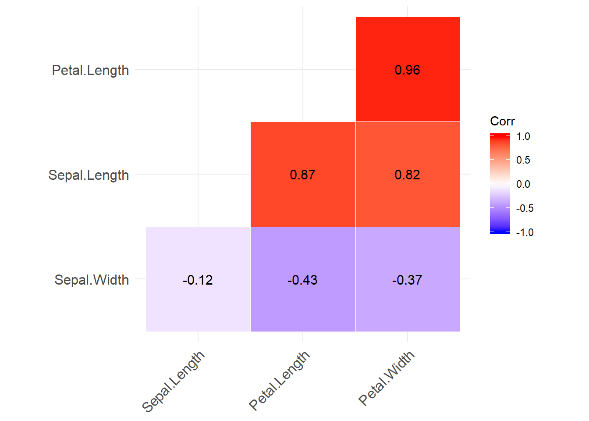
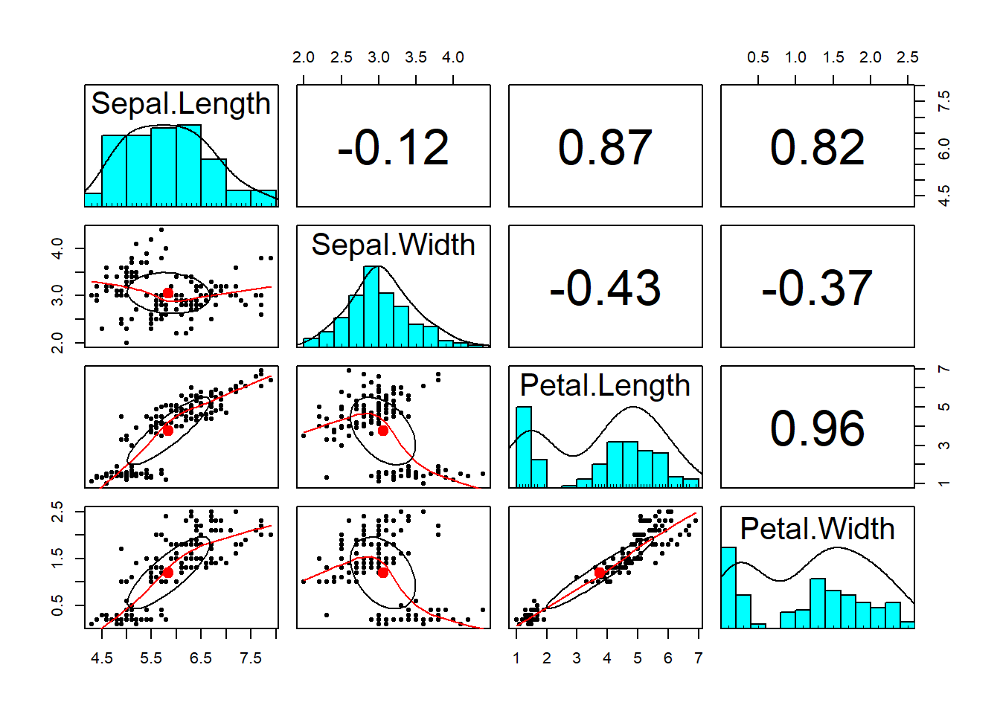

# Basic data summarization

Data summarization - the art of conveying the same information in less time/space or conveying more information in the same amount of time/space.  Data summarization is typically numerical or visual (or combined) and is a key skill in data analysis as we use it to provide insights both to others and to ourselves. Data summarization is also an important component of exploratory data analysis. In this chapter we will focus on the basic techniques for univariate and bivariate data. Other, more advanced data summarization techniques will be covered in a later chapter.

We will be using R and ggplot2, but the contents of this chapter are meant to be tool-agnostic. Readers should use the programming language and tools that they are most comfortable with. However, do not sacrifice expresiveness or profesionallism for the sake of convenience - if your current toolbox limits you in any way, learn new tools!

## Descriptive statistics for univariate distributions

We humans are on average not particularly good at thinking in multiple dimensions, so, in practice, there will be a tendency to look at individual variables/dimensions. That is, in practice, we will most of the time be summarizing univariate distributions.

Univariate distributions come from various sources. It might be a theoretical distribution, an empirical cumulative distribution function of a data sample, a probabilistic opinion from a person, a posterior distribution of a parameter from a Bayesian model, and many others. Descriptive statistics apply to all of these cases in the same way, regardless of the source of the distribution.

Before we proceed with introducing the most commonly used descriptive statistics, let us discuss their main purpose. The main purpose of any sort of data summarization technique is to (a) reduce the time/effort of delivering information to the reader in a way that (b) we lose as little relevant information as possible. That is, to compress the information. For example, in the extreme case we could just show the reader the entire distribution/density ever time, but that would consume a lot of space and a lot of the readers time and effort. All summarization methods do (a) but we must be careful to choose an appropriate method so that we also get (b). Summarizing out relevant information can lead to misleading summaries, as we will illustrate with several examples later in the chapter.

### Central tendency

The most common ways of measuring central tendency (or location) of a distribution are:

* the mean (the mass centre of the distribution),
* the median or 2nd quartile (the value such that half of the mass is on one and half on the other side),
* the mode (the most probable value or the value with the highest density).

Given a sample of data, the mean is the easiest to estimate/compute (we compute the average), but the median and mode are more robust to outliers.

In the case of unimodal approximately symmetrical distributions, such as the univariate normal distribution, all these measures of central tendency will be similar and all will be an excellent summary of location. If the distribution is asymmetrical or skewed, they will differ. In such cases it is our job to determine what information we want to convey and which summary of central tendency is the most appropriate, if any. 

For example, observe the Gamma(1.5, 0.1) distribution and its mean (red), median (blue) and mode (green):


```r
x <- seq(0, 50, 0.01)
a <- 1.5
b <- 0.1
y <- dgamma(x, a, b)

library(ggplot2)
ggplot(data.frame(x,y), aes(x = x, y = y)) + geom_line() + ylab("p(x)") +
  geom_vline(xintercept = (a-1) / b, colour = "green", lty = "dashed", lwd = 1.5) + 
    geom_vline(xintercept = a / b, colour = "red", lty = "dashed", lwd = 1.5) + 
   geom_vline(xintercept = qgamma(0.5, a, b), colour = "blue", lty = "dashed", lwd = 1.5)
```


In the case of multi-modal distributions, no single measure of central tendency will adequately summarize the distribution - they will all be misleading. For example, look at this bimodal distribution:


```r
x <- seq(-10, 20, 0.01)
y <- 0.6 * dnorm(x, 2, 1) + 0.4 * dnorm(x, 12, 2)

library(ggplot2)
ggplot(data.frame(x,y), aes(x = x, y = y)) + geom_line() + ylab("p(x)") +
    geom_vline(xintercept = 0.6* 2 + 0.4 * 15, colour = "red", lty = "dashed", lwd = 1.5) +
   geom_vline(xintercept = 2, colour = "green", lty = "dashed", lwd = 1.5)
```


### Dispersion

The most common ways of measuring dispersion (or spread or scale) of a distribution are:

* variance (mean of quadratic distances from mean) or, more commonly, standard deviation (root of variance, so we are on the same scale as the measurement)
* median absolute deviation (median of absolute distances from mean),
* quantile-based intervals, in particular the inter-quartile range (IQR) (interval between the 1st and 3rd quartiles, 50% of the mass/density lies in this interval).

As the measures of central tendency summarize the centre of the distribution, measures of dispersion summarize how far spread out is the distribution around its centre. Standard deviation is the most commonly used and median absolute deviation is more robust to outliers.

Again, in the case of distributions that are approximately normal, the standard deviation and the mean will be the practically optimal choice for summarization, because they correspond directly to the two parameters of the normal distribution. That is, they completely summarize the distribution without loss of information. We also know that approximately 95% (99%) of the normal density lies within 2 (3) standard deviations from the mean. Standard deviation is useful even if the distribution is not approximately normal as it does provide some information, combined with the sample size (producing the standard error), on how certain we can be in our estimate of the mean.

But, as before, the more we deviate from normality, the less meaningful standard deviation becomes and it makes more sense to use quantile-based intervals. For example, if we estimate the mean and $\pm$ 2 standard deviations for samples from the Gamma distribution from before, we get the following:


```r
set.seed(0)
x <- rgamma(1000, a, b)
cat(sprintf("%.2f +/- %.2f\n", mean(x), 2*sd(x)))
```

```
## 14.66 +/- 24.49
```

That is, the 95% interval estimated this way also includes negative values, which is absurd and misleading - we know the Gamma distributed variables are positive. Computing the IQR or the 95% range interval provides a more sensible summary of this skewed distribution and, together with the mean also serve as an indicator that the distribution is skewed (the mean is not the centre of the intervals):


```r
set.seed(0)
x <- rgamma(1000, a, b)
cat(sprintf("%.2f, IQR = [%.2f, %.2f], 95pct = [%.2f, %.2f]\n", mean(x), quantile(x, 0.25), quantile(x, 0.75), quantile(x, 0.025), quantile(x, 0.975)))
```

```
## 14.66, IQR = [5.72, 20.76], 95pct = [1.18, 46.09]
```

And, again, for multi-modal distributions, we can adequately summarize them only by identifying the modes visually and/or describing each mode individually.


### Skewness and kurtosis

As mentioned above, ranges can be used to indicate a distributions asymmetry (skewness) or fat-tailedness (kurtosis). Although less commonly used, there exist numerical summaries of skewness and kurtosis that can be used instead.

The following example shows the kurtosis and skewness for a gamma, normal, logistic and bimodal distribution. Observe how how the bimodal distribution has the lowest kurtosis, because the method fails:


```r
library(moments)
set.seed(0)
tmp <- NULL

for (i in 1:4) {
  if (i == 1) x <- rgamma(1000, a, b)
  if (i == 2) x <- rnorm(1000, 0, 9)
  if (i == 3) x <- rlogis(1000, 0, 9)
  if (i == 4) x <- c(rnorm(700, 0, 9), rnorm(300, 35, 4))
  
  s <- paste0("kurtosis = ", round(kurtosis(x), 2), " skewness =", round(skewness(x), 2))
  tmp <- rbind(tmp, data.frame(x = x, name = s))
}

ggplot(tmp, aes(x = x)) + geom_histogram(bins = 50) + facet_wrap(.~name)
```




### Nominal variables

Nominal variables are typically represented with the relative frequencies or probabilities, numerically or visually, but that is not really a summary, because it is also all the information about a nominal variable. That the methods discussed so far in this section apply to numerical variables (rational, interval and to some extent, ordinal) but not nominal variables, because the notions of location and distance do not exist in the nominal case. The only exception to this is the mode, which is the level of the nominal variable with the highest relative frequency or probability. 

One summary that is often useful for summarizing the dispersion or the uncertainty associated with a nominal variable is entropy. Observe the following example:


```r
entropy <- function(x) {
  x <- x[x != 0]
  -sum(x * log2(x))
}

entropy(c(0.5, 0.5)) # fair coin
```

```
## [1] 1
```

```r
entropy(c(0.8, 0.2)) # biased coin
```

```
## [1] 0.7219281
```

```r
entropy(c(1.0, 0.0)) # coin with heads on both sides
```

```
## [1] 0
```

A fair coin has exactly 1 bit of entropy - we receive 1 bit of information by observing the outcome of a flip. This is also the maximum achievable entropy for a binary variable. A biased coin has lower entropy - we receive less information. In the extreme case of a coin with heads on both sides, the entropy is 0 - the outcome of a flip brings no new information, as we already know it will be heads.

When we want to compare entropy across variables with different numbers of levels/categories, we can normalize it by dividing it with the maximum achieavable entropy. For example, observe a fair coin and a fair 6-sided die - in absolute terms, the 6-sided die has higher entropy due to having more possible values. However, relatively to the maximum achievable entropy, both represent maximally uncertain distributions:


```r
entropy(c(0.5, 0.5)) # fair coin
```

```
## [1] 1
```

```r
entropy(rep(1/6, 6)) # fair 6-sided die
```

```
## [1] 2.584963
```

Note that entropy can easily be calculated for any discrete random variable. Entropy also has a continuous analogue - differential entropy.

### Testing the shape of a distribution

Often we want to check if the distribution that underlies our data has the shape of some hypothesized distribution (for example, the normal distribution) or if two samples come from the same distribution. Here, we will present two of the most common methods used: the Kolmogorov-Smirnov test and the Chi-squared goodness-of-fit test. Both of these are Null-hypothesis significance tests (NHST), so, before we proceed, be aware of two things. First, do not use NHST blindly, without a good understanding of their properties and how to interpret their results. And second, if you are more comfortable with thinking in terms of probabilities of hypotheses as opposed to significance and p-values, there always exist Bayesian alternatives to NHST.

The **Kolmogorov-Smirnov test** (KS) is a non-parametric test for testing the equality of two cumulative distribution functions (CDF). These can be two empirical CDFs or an empirical CDF and a theoretical CDF. The KS test statistic is the maximum distance between the two corresponding CDFs. That is, we compute the distribution of this statistic under the null-hypothesis that the CDFs are the same and then observe how extreme the maximum distance is on the sample. To illustrate the KS test, we use it to test the normality of the underlying distributions for two samples - one from a logistic distribution, one from a standard normal distribution. And then to test if the two samples come from the same distribution:


```r
set.seed(0)
x1 <- rlogis(80, 0, 1)
x2 <- rnorm(80, 0, 1)
ks.test(x1, y = "pnorm", 0, 1)
```

```
## 
## 	One-sample Kolmogorov-Smirnov test
## 
## data:  x1
## D = 0.1575, p-value = 0.03362
## alternative hypothesis: two-sided
```

```r
ks.test(x2, y = "pnorm", 0, 1)
```

```
## 
## 	One-sample Kolmogorov-Smirnov test
## 
## data:  x2
## D = 0.070067, p-value = 0.801
## alternative hypothesis: two-sided
```

```r
ks.test(x1, x2)
```

```
## 
## 	Two-sample Kolmogorov-Smirnov test
## 
## data:  x1 and x2
## D = 0.175, p-value = 0.173
## alternative hypothesis: two-sided
```

So, with a 5% risk (95% confidence), we would reject the null hypothesis that our sample x1 is from a standard normal distribution. On the other hand, we would not reject that our sample x1 is from a standard normal distribution. Finally, we would not reject the null hypothesis that x1 and x2 come from the same distribution. The only guarantee that comes with these results is that we will in the long run falsely reject a true null-hypothesis at most 5% of the time. It says very little about our overall performance, because we do not know the ratio of cases when the null-hypothesis will be true.

This example also illustrates the complexity of interpreting NHST results or rather all the tempting traps laid out for us - we might be tempted to conclude, based on the high p-value, that x2 does indeed come from a standard normal, but that then leads us to a weird predicament that we are willing to claim that x1 is not standard normal, x2 is standard normal, but we are less sure that x1 and x2 have different underlying distributions.

Note that typical implementations of the KS test assume that the underlying distributions are continuous and ties are therefore impossible. However, the KS test can be generalized to discrete and mixed distributions (see R package KSgeneral).

Differences in between distributions can also be assessed visually, through the **QQ-plot**, a plot that compares the quantiles of the two distributions. If the distributions have the same shape, their quantiles, plotted together, should lie on the same line. The samples from the logistic distribution obviously deviate from the theoretical quantiles of a normal distribution:


```r
tmp <- data.frame(y = x1)
ggplot(tmp, aes(sample = y)) + stat_qq() + stat_qq_line()
```



The **Chi-squared goodness-of-fit** test (CHISQ) is a non-parametric test for testing the equality of two categorical distributions. The CHISQ test can also be used on discrete or even continuous data, if there is a reasonable way of binning the data into a finite number of bins. The test statistic is based on a similar idea as the KS test statistic, but instead of observing just the maximum difference, we sum the squared difference between the relative frequency of the two distributions for a bin across all bins. We illustrate the CHISQ test by testing the samples for a biased coin against a theoretical fair coin and the samples from an unbiased 6-sided die against a theoretical fair 6-sided die.


```r
set.seed(0)
x <- table(sample(0:1, 30, rep = T, prob = c(0.7, 0.3)))
chisq.test(x, p = c(0.5, 0.5)) # the default is to compare with uniform theoretical, but we make it explicit here
```

```
## 
## 	Chi-squared test for given probabilities
## 
## data:  x
## X-squared = 3.3333, df = 1, p-value = 0.06789
```

```r
x <- table(sample(0:1, 40, rep = T, prob = c(0.7, 0.3)))
chisq.test(x, p = c(0.5, 0.5))
```

```
## 
## 	Chi-squared test for given probabilities
## 
## data:  x
## X-squared = 10, df = 1, p-value = 0.001565
```

```r
x <- table(sample(1:6, 40, rep = T))
chisq.test(x)
```

```
## 
## 	Chi-squared test for given probabilities
## 
## data:  x
## X-squared = 5.3, df = 5, p-value = 0.3804
```

So, with a 5% risk (95% confidence), we would reject the null hypothesis that our coin is fair, but only in the case with 40 samples. Because fair or close-to fair coins have high entropy, we typically require a lot of samples to distinguish between their underlying probabilities.

For a more real-world example, let us take the exit-poll data for the 2016 US Presidential election, broken down by gender, taken from (https://edition.cnn.com/election/2016/results/exit-polls):


```r
n <- 24588
male     <- round(0.47 * n * c(0.41, 0.52, 0.07)) # some rounding, but it should not affect results
female   <- round(0.53 * n * c(0.54, 0.41, 0.05))
x        <- rbind(male, female)
colnames(x) <- c("Clinton", "Trump", "other/no answer")
print(x)        # this is also known as a contingency table and the subsequent test as a contingency test
```

```
##        Clinton Trump other/no answer
## male      4738  6009             809
## female    7037  5343             652
```

```r
chisq.test(x)
```

```
## 
## 	Pearson's Chi-squared test
## 
## data:  x
## X-squared = 417.71, df = 2, p-value < 2.2e-16
```

So, at any reasonable confidence level, we would reject the null-hypothesis and conclude that there is a difference in how men and women voted. In fact, we do not even need a test, because the difference is so obvious and the sample size so large. The differences between those who earned less or more than 100k$, however, appear smaller, so a test makes more sense:


```r
n <- 24588
less100     <- round(0.66 * n * c(0.49, 0.45, 0.06)) # some rounding, but it should not affect results
more100     <- round(0.34 * n * c(0.47, 0.47, 0.06))
x           <- rbind(less100, more100)
colnames(x) <- c("Clinton", "Trump", "other/no answer")
print(x)
```

```
##         Clinton Trump other/no answer
## less100    7952  7303             974
## more100    3929  3929             502
```

```r
chisq.test(x)
```

```
## 
## 	Pearson's Chi-squared test
## 
## data:  x
## X-squared = 9.3945, df = 2, p-value = 0.00912
```

Still, we can at most typical levels of confidence reject the null-hypothesis and conclude that that there is a pattern here as well.

## Descriptive statistics for bivariate distributions

When dealing with a joint distribution of two variables (that is, paired samples), the first thing we are typically interested in is dependence of the two variables or lack thereof. If two distributions are independent, we can summarize each separately without loss of information. If they are not, then the distributions carry information about eachother. The predictability of one variable from another is another (equivalent) way of looking at dependence of variables.

The most commonly used numerical summary of dependence is the **Pearson correlation coefficient** or Pearson's $\rho$. It summarizes the linear dependence, with $\rho = 1$ and $\rho = - 1$ indicating perfect colinearity (increasing or decreasing) and $\rho = 0$ indicating linear independence. As such, Pearson's $\rho$ is directly related (squared root) to the coefficient of determination $R^2$, a goodness-of-fit measure for linear models and the proportion of variance in one explained by the other variable. An important consideration is that the statement that linear independence implies independence is not true in general (the converse implication is). One notable exception where this implication is true is the multivariate Normal distribution, where the dependence structure is expressed through linear dependence only.

Two of the most popular alternatives to Pearson's $\rho$ are Spearman's $\rho$ and Kendalls $\tau$. The former measures the degree to which one variable can be expressed as monotonic function of the other. The latter measures the proportion of concordant pairs among all possible pairs (pairs (x1,y1) and (x2, y2), wher if x1 > x2 then y1 > y2). As such, they can capture non-linear dependence and is more appropriate for data with outliers or data where distance might have no meaning, such as ordinal data. Spearman's $\rho$ and Kendall's $\tau$ are more robust but do not have as clear an interpretation as Pearson's $\rho$. Kendall's tau is also computationally more expensive.

Below are a few examples of bivariate samples that illustrate the strengths and limitations of the above correlation coefficients:


```r
set.seed(0)
library(MASS)
m <- 100

dat <- NULL
# data 1
sigma <- matrix(c(1, 0, 0, 1), nrow = 2)
x <- mvrnorm(m, mu = c(0, 0), Sigma = sigma )
txt <- sprintf("Pearson's = %.2f\nSpearman's = %.2f\nKendall's = %.2f", cor(x)[1,2], cor(x, method = "spearman")[1,2], cor(x, method = "kendall")[1,2])
dat <- rbind(dat, data.frame(x = x[,1], y = x[,2], example = txt))

# data 2
sigma <- matrix(c(1, -0.5, -0.5, 1), nrow = 2)
x <- mvrnorm(m, mu = c(0, 0), Sigma = sigma )
txt <- sprintf("Pearson's = %.2f\nSpearman's = %.2f\nKendall's = %.2f", cor(x)[1,2], cor(x, method = "spearman")[1,2], cor(x, method = "kendall")[1,2])
dat <- rbind(dat, data.frame(x = x[,1], y = x[,2], example = txt))

# data 3
sigma <- matrix(c(1, 0.95, 0.95, 1), nrow = 2)
x <- mvrnorm(m, mu = c(0, 0), Sigma = sigma )
txt <- sprintf("Pearson's = %.2f\nSpearman's = %.2f\nKendall's = %.2f", cor(x)[1,2], cor(x, method = "spearman")[1,2], cor(x, method = "kendall")[1,2])
dat <- rbind(dat, data.frame(x = x[,1], y = x[,2], example = txt))

# data 4
x <- rnorm(m, 0, 1)
y <- 2 * pnorm(x) + rnorm(m, 0, 0.05)
x <- cbind(x, y)
txt <- sprintf("Pearson's = %.2f\nSpearman's = %.2f\nKendall's = %.2f", cor(x)[1,2], cor(x, method = "spearman")[1,2], cor(x, method = "kendall")[1,2])
dat <- rbind(dat, data.frame(x = x[,1], y = x[,2], example = txt))

# data 5
sigma1 <- matrix(c(1, -0.5, -0.5, 1), nrow = 2)
sigma2 <- matrix(c(0.1, 0, 0, 0.1), nrow = 2)
x <- rbind(mvrnorm(m, mu = c(0, 0), Sigma = sigma ), mvrnorm(50, mu = c(3, -2), Sigma = sigma2 ))
txt <- sprintf("Pearson's = %.2f\nSpearman's = %.2f\nKendall's = %.2f", cor(x)[1,2], cor(x, method = "spearman")[1,2], cor(x, method = "kendall")[1,2])
dat <- rbind(dat, data.frame(x = x[,1], y = x[,2], example = txt))

# data 6
z <- runif(m, 0, 2*pi)
x <- cbind(cos(z), sin(z))
txt <- sprintf("Pearson's = %.2f\nSpearman's = %.2f\nKendall's = %.2f", cor(x)[1,2], cor(x, method = "spearman")[1,2], cor(x, method = "kendall")[1,2])
dat <- rbind(dat, data.frame(x = x[,1], y = x[,2], example = txt))


ggplot(dat, aes(x = x, y = y)) + geom_point() + facet_wrap(.~example, ncol = 3, scales = "free")
```


Like similar questions about other parameters of interest, the question *Is <insert number here> a strong correlation?* is a practical question. Unless the correlation is 0 (no correlation) or 1/-1 (perfectly correlated, can't be more correlated than this), the meaning of the magnitude of correlation depends on the practical setting and its interpretation depends on some reference level. Even a very low correlation, such as 0.001 (if we are reasonably sure that it is around 0.001) can be practically meaningful. For example, if it is correlation between the even and odd numbers generated by a uniform random number generator (RNG), that would be more than enough correlation to stop using this RNG. 

## Visualization

As we mentioned at the beginning - summarization is the art of conveying the same information in less time/space or conveying more information in the same amount of time/space. Visual summaries are often a more informative, faster and more concise alternative to numerical summaries.

Throughout this section we'll be using the NBA players dataset that contains some basic information about nba


```r
dat <- read.csv("./data/NBAplayers.csv")
dat <- dat[complete.cases(dat),]
dat$height <- dat$h_feet * 30.48 + dat$h_inches * 2.54 # in cm
dat$weight <- dat$weight * 0.4536
summary(dat)
```

```
##        ilkid        firstname        lastname    position  firstseason  
##  ABDELAL01:   1   John   :  90   Williams:  66   C: 627   Min.   :1946  
##  ABDULKA01:   1   Bob    :  88   Smith   :  54   F:1665   1st Qu.:1967  
##  ABDULMA01:   1   Jim    :  70   Johnson :  52   G:1614   Median :1980  
##  ABDULTA01:   1   Mike   :  66   Jones   :  44            Mean   :1979  
##  ABDURSH01:   1   Bill   :  54   Davis   :  37            3rd Qu.:1995  
##  ABERNTO01:   1   Tom    :  46   Brown   :  34            Max.   :2009  
##  (Other)  :3900   (Other):3492   (Other) :3619                          
##    lastseason       h_feet         h_inches          weight      
##  Min.   :1946   Min.   :5.000   Min.   :-6.000   Min.   : 60.33  
##  1st Qu.:1970   1st Qu.:6.000   1st Qu.: 3.000   1st Qu.: 83.92  
##  Median :1985   Median :6.000   Median : 6.000   Median : 92.99  
##  Mean   :1983   Mean   :6.022   Mean   : 5.581   Mean   : 93.91  
##  3rd Qu.:2001   3rd Qu.:6.000   3rd Qu.: 8.000   3rd Qu.:102.06  
##  Max.   :2009   Max.   :7.000   Max.   :11.500   Max.   :149.69  
##                                                                  
##                                    college                   birthdate   
##                                        : 200   1945-01-01 00:00:00:   8  
##  University of California - Los Angeles:  72   1944-01-01 00:00:00:   5  
##  University of North Carolina          :  71   1921-01-01 00:00:00:   4  
##  University of Kentucky                :  67   1931-01-01 00:00:00:   4  
##  Indiana University                    :  54   1919-01-01 00:00:00:   3  
##  University of Kansas                  :  52   1923-09-18 00:00:00:   3  
##  (Other)                               :3390   (Other)            :3879  
##      height     
##  Min.   :160.0  
##  1st Qu.:190.5  
##  Median :198.1  
##  Mean   :197.7  
##  3rd Qu.:205.7  
##  Max.   :231.1  
## 
```

### The evolution of a plot

The above will also be our guidelines for improving our visualizations. Can we convey the same information in substantially less time/space? Can we convey more information without using more time/space? If the answer is yes, then we should!

We'll illustrate this point with an example that features some common mistakes or inefficiencies people do when visualizing data. Our goal will be to summarize how the average height of NBA Centers, Forwards, and Guards that started that year has changed over time.

Let's plot the averages over time:


```r
tmp <- dat[dat$position == "G",]
plot(tapply(tmp$height, tmp$firstseason, mean))
```


```r
tmp <- dat[dat$position == "F",]
plot(tapply(tmp$height, tmp$firstseason, mean))
```



```r
tmp <- dat[dat$position == "C",]
plot(tapply(tmp$height, tmp$firstseason, mean))
```


The plots reveal information that the average height of rookies has been increasing over time for all three groups of players. However, we should immediately recognize plotting 3 things separately that could be plotted on the same plot wastes space and the reader's time, having to jump back and forth from one plot to another. This also makes comparison of the time series very difficult. Remember that how we present our results is how we treat our reader. These kind of plots say to the reader that our time and convenience are more important than theirs.

Let's remedy this mistake:


```r
tmp <- dat[dat$position == "G",]
plot(tapply(tmp$height, tmp$firstseason, mean), col = "green", ylim = c(180, 220))
tmp <- dat[dat$position == "F",]
points(tapply(tmp$height, tmp$firstseason, mean), col = "red")
tmp <- dat[dat$position == "C",]
points(tapply(tmp$height, tmp$firstseason, mean), col = "black")
```


This plot uses up only a third of the space and simplifies comparison. This reveals new information, such as that centers (black) are higher than forwards (red) who are higher than guards (green), that there was a more steep increase in the beginning of the period and that forwards these days are as high on average as centers were in the past.

However, there are several things that we can still improve on. The first will be one of the fundamental rules of statistical plotting - **always label your axes**! The reader should never look elsewhere for information about what is plotted. We will also take this opportunity to reorganize our data:


```r
library(reshape2)
tmp <- melt(tapply(dat$height, list(dat$position, dat$firstseason), mean))
names(tmp) <- c("position", "year", "height")
plot(tmp$year, tmp$height, col = tmp$position, xlab = "year", ylab = "average rookie height (cm)")
```


This is starting to look better. However, we should also include the legend - if we describe the meaning of the colors in the figure caption (or worse, in text), the reader will have to jump from text to figure, wasting time. Additionally, some people (and publications) prefer to add a title to their plot, explaining concisely what is in it, therefore making it more self containes. Others prefer to explain the plot in the caption. We'll add a title:


```r
tmp <- melt(tapply(dat$height, list(dat$position, dat$firstseason), mean))
names(tmp) <- c("position", "year", "height")
plot(tmp$year, tmp$height, col = tmp$position, xlab = "year", ylab = "average rookie height (cm)")
legend(1997, 190, legend=c("centers", "forwards", "guards"),
       col=c("black", "red", "green"), lty = 1, cex=0.8)
title("The average height of NBA rookies by playing position over time.")
```


This is now a quite decent and self-contained plot. Next, we'll add a bit of polish. Pleasing aesthetics might not add much to the informativeness of a plot, but they do make our work look more professional. They are also indicate that we put in the extra effort. Of course, we should never let aesthetics get in the way of efficiency and informativeness (see pie-chart example in the following section):


```r
tmp <- melt(tapply(dat$height, list(dat$position, dat$firstseason), mean))
names(tmp) <- c("position", "year", "height")
levels(tmp$position) <- c("centers", "forwards", "guards")
ggplot(tmp, aes(x = year, y = height, colour = position)) + geom_point() + 
  xlab("year") + ylab("average rookie height (cm)") + ggtitle("The average height of NBA rookies by playing position over time.") +
  theme_bw()
```


By using ggplot2 we can make our visualizations look better, but it is also very convenient for adding some extra layers to our plots. For example, a smoothed line with standard errors to help us focus on the trend and not the individual data points:


```r
tmp <- melt(tapply(dat$height, list(dat$position, dat$firstseason), mean))
names(tmp) <- c("position", "year", "height")
levels(tmp$position) <- c("centers", "forwards", "guards")
ggplot(tmp, aes(x = year, y = height, colour = position)) + geom_point() + geom_smooth(method = "loess") +
  xlab("year") + ylab("average rookie height (cm)") + ggtitle("The average height of NBA rookies by playing position over time.") +
  theme_bw()
```


There is one more thing that we can typically do in such cases - label the data directly and omit the legend. This saves both space and user's time, especially if we have several lines/colors in our plot:


```r
tmp <- melt(tapply(dat$height, list(dat$position, dat$firstseason), mean))
names(tmp) <- c("position", "year", "height")
levels(tmp$position) <- c("centers", "forwards", "guards")
ggplot(tmp, aes(x = year, y = height, colour = position)) + geom_point() + geom_smooth(method = "loess") +
  xlab("year") + ylab("average rookie height (cm)") + ggtitle("The average height of NBA rookies by playing position over time.") +
  theme_bw() + theme(legend.position = "none") + 
   annotate("text", x = 1970, y = 212, label = "centers", colour = "red") +
  annotate("text", x = 1970, y = 203, label = "forwards", colour = "darkgreen") +
  annotate("text", x = 1970, y = 192, label = "guards", colour = "blue")
```

<div class="figure">

<p class="caption">(\#fig:unnamed-chunk-21)The data show that the average heights of all three groups of players have been increasing. The difference between forwards and centers is approximately the same throughout the period while the average height of guards has been increasing at a slower pace. Note that the lines are loess smoothed lines with standard error estimates.</p>
</div>

We've equipped the above plot with a caption that states the information that we would like to point out to the reader (the plot serves as a visual summary and argument). There is always something we can tweek and improve in a plot, depending on the situation, but if all of our plots will be at least at the level of this plot, that will be of sufficient standards.


### Common types of plots

Now we quickly run through some of the most common types of plots for univariate data.

## Histograms and density plots

The most elementary way of summarizing data is to plot their density. Of course, the true density is unknown and we can only estimate it by using a model or a non-parametric (smoothing) kernel density estimation. A histogram (binning the data and plotting the frequencies) can be viewed as a more coarse or discrete way of estimating the density of the data.

In both density plots and histograms we need to specify the amount of smoothing (smoothing kernel width or bin size) - most build-in functions do it for us, but there is no optimal way of doing it, so we can often improve the plot by selecting a more appropriate degree of smoothing. When we have more data, we can get away with less smooting and reveal more characterisics of the underlying distribution.

We illustrate these two plots by summarizing NBA player weight:


```r
ggplot(dat, aes(x = weight)) + geom_histogram(aes(y=..density..), alpha=0.5, 
                position="identity", binwidth = 7) + geom_density(lwd = 1, col = "black") + theme_bw()
```

<div class="figure">

<p class="caption">(\#fig:unnamed-chunk-22)Histogram and density estimation of NBA player weight</p>
</div>


## Bar plot

Bar plots are the most common choice for summarizing the (relative) frequencies for categorical or ordinal data with a manageable number of unique values. It is similar to a histogram, except that the categories/values provide a natural way of binning the data:


```r
set.seed(0)
tmp <- data.frame(University = dat$college)
x <- table(tmp)
x <- x[x >= 5]
x <- sample(x, 10, rep = F)
x <- sort(x)
ggplot(data.frame(x), aes(x = tmp, y = Freq)) + geom_bar(stat = "identity") + coord_flip() +
  xlab("University") + ylab("number of players")
```

<div class="figure">

<p class="caption">(\#fig:unnamed-chunk-23)The number of NBA players that came from these 10 Universities.</p>
</div>

When the number of unique values is large, it will not be not possible to visualize all of them (try visualizing the frequencies for all universities in the above example). In such cases we may opt to group some values or show only certain values.


```r
set.seed(0)
tmp <- data.frame(University = dat$college)
x <- table(tmp)
x <- x[x >= 5]
x <- sample(x, 10, rep = F)
x <- sort(x)
ggplot(data.frame(x), aes(x = tmp, y = Freq)) + geom_bar(stat = "identity") + coord_flip() +
  xlab("University") + ylab("number of players")
```

<div class="figure">

<p class="caption">(\#fig:unnamed-chunk-24)The number of NBA players that came from these Universities.</p>
</div>

## Pie chart

Pie charts are quite possibly the easiest chart type to work with, because there is only one rule to using pie charts - **don't use pie charts**. Let's visualize the data from the bar chart example:


```r
y <- x / sum(x)
ggplot(data.frame(y), aes(x = "", y = Freq, fill = tmp)) + geom_bar(width = 1, stat = "identity") + coord_polar("y", start=0) + theme_bw() + labs(fill = "University")
```

<div class="figure">

<p class="caption">(\#fig:unnamed-chunk-25)The relative frequencies of NBA players that came from these Universities.</p>
</div>

The pie chart is a great example (and warning!) of how aesthetics can get in the way of function and effectiveness. It is well documented that people are poor at comparing areas and especially angles. Could you recognize quickly from the above pie chart that University of Washington gave approximately twice as many players as University of Texas? How quickly would you be able to judge these relationships from the bar chart?

Angles can also play tricks on our eyes. Which color pie slice is the largest on the first plot below? Which on the second plot?


```r
y <- data.frame(Name = c("A", "B", "C"), Value = rep(1, 3))
ggplot(data.frame(y), aes(x = "", y = Value, fill = Name)) + geom_bar(width = 1, stat = "identity") + coord_polar("y", start=0) + theme_bw() + theme(legend.position = "none")
```


```r
ggplot(data.frame(y), aes(x = "", y = Value, fill = Name)) + geom_bar(width = 1, stat = "identity") + coord_polar("y", start=pi/3) + theme_bw() + theme(legend.position = "none")
```


For more information on how people percieve visual objects and relationships between them (distances, angles, areas), we recommend the pioneering work of Cleveland.

## Scatterplot

The scatterplot is the most common plot for summarizing the relationship between two numerical variables. In this chapter we've already seen several examples of scatterplots. Here, we use three of them to summarize the relationship between player weight and player height by position.


```r
ggplot(dat, aes(x = height, y = weight)) + geom_jitter(width = 3) + theme_bw() + facet_wrap(.~position)
```

<div class="figure">

<p class="caption">(\#fig:unnamed-chunk-27)Relationship between player weight and height by player position. Note that we introduced a bit of jitter - this is a common approach to dealing with numerical data where we have a limited number of unique values (such as rounded data)to reveal where we have more points.</p>
</div>

## 2D density plot

When individual points are of little interest and we just want to summarize the density of the joint distribution, a 2D density plot is a good alternative to the scatterplot.


```r
ggplot(dat, aes(x = height, y = weight, colour = position)) + geom_density_2d() + theme_bw() + 
  theme_bw() + theme(legend.position = "none") + 
  annotate("text", y = 90, x = 212, label = "centers", colour = "red") +
  annotate("text", y = 80, x = 203, label = "forwards", colour = "darkgreen") +
  annotate("text", y = 73, x = 192, label = "guards", colour = "blue")
```

<div class="figure">

<p class="caption">(\#fig:unnamed-chunk-28)Relationship between player weight and height by player position.</p>
</div>

## Boxplot

A boxplot is named by the boxes that typicaly summarize the quartiles of the data. Sometimes, whiskers are added to indicate outliers. It useful for quickly visually summarizing, side-by-side, several numerical variables or to summarize the relationship between a categorical/ordinal variable and a numerical variable. Here, we use it so summarize weight by playing position.


```r
ggplot(dat, aes(x = position, y = weight)) + geom_boxplot(width = 0.1) + theme_bw()
```

<div class="figure">

<p class="caption">(\#fig:unnamed-chunk-29)Summary of player weight by position.</p>
</div>

## Violin plot

The boxplot shows only the quartiles so it can sometimes be misleading or hide information. An alternative is to plot the entire density estimates. Such a plot is called a violin plot.


```r
ggplot(dat, aes(x = position, y = weight)) + geom_violin(fill = "lightblue") + geom_boxplot(width = 0.05) + theme_bw()
```

<div class="figure">

<p class="caption">(\#fig:unnamed-chunk-30)Summary of player weight by position. Note that we combined the violin plot with the boxplot to facilitate comparison.</p>
</div>

## Correlogram

When we want to quickly inspect if there are any correlations between numerical variables, we can summarize correlation coefficients in a single plot. Such a plot is also known as a correlogram. Here we do it for the iris dataset:


```r
library(ggcorrplot)
```

```
## Warning: package 'ggcorrplot' was built under R version 3.5.3
```

```r
corr <- round(cor(iris[,-5]),2)
ggcorrplot(corr, hc.order = TRUE, type = "lower", outline.col = "white", lab = T)
```

<div class="figure">

<p class="caption">(\#fig:unnamed-chunk-31)Summary of the numerical variables in the iris dataset.</p>
</div>

## A comprehensive summary

Sometimes it will be useful to summarize the density/histogram of several numerical variables and the correlation between them. Here is an example of how we can combine histograms/density plots, scatterplots, and information about correlation:


```r
library(psych)
```

```
## Warning: package 'psych' was built under R version 3.5.3
```

```
## 
## Attaching package: 'psych'
```

```
## The following objects are masked from 'package:ggplot2':
## 
##     %+%, alpha
```

```r
pairs.panels(iris[,-5])
```

<div class="figure">

<p class="caption">(\#fig:unnamed-chunk-32)Summary of the numerical variables in the iris dataset.</p>
</div>


## Further reading and references

Kanji, G. K. (2006). 100 statistical tests. Sage.


Fundamentals of Descriptive Statistics 1st Edition
by Zealure Holcomb (Author) 


ggplot2: Elegant Graphics for Data Analysis (Use R!) 1st ed. 2009. Corr. 3rd printing 2010 Edition

Visualize This: The FlowingData Guide to Design, Visualization, and Statistics

 Graphical Perception: Theory, Experimentation, and Application to the Development of Graphical Methods
William S. Cleveland and Robert McGill
Journal of the American Statistical Association
Vol. 79, No. 387 (Sep., 1984), pp. 531-554 


## Learning outcomes

Data science students should work towards obtaining the knowledge and the skills that enable them to:

* Reproduce the techniques demonstrated in this chapter using their language/tool of choice.
* Produce visualizations that are aesthetic and without major techical flaws.
* Recognize when a type of summary is appropriate and when it is not.
* Apply data summarization techiques to obain insights from data.
* Once introduced to the bootstrap and other estimation techniques, to be able to combine descriptive statistics with a quantification of uncertainty, such as confidence intervals.

## Practice problems

TODO: Basically, take a rich enough dataset and demonstrate most if not all summarization techniques shown here. For each summary, add an interpretation of the insights it provides.
