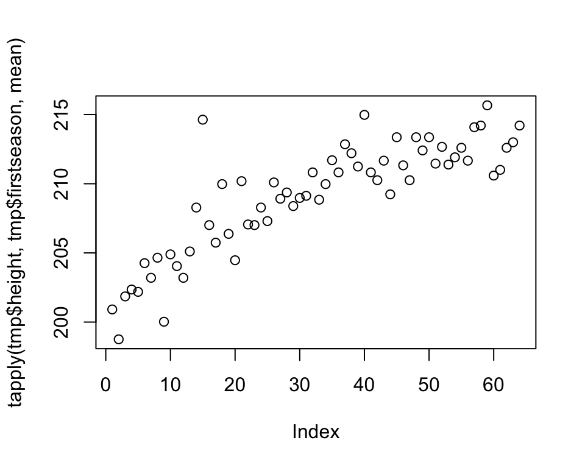
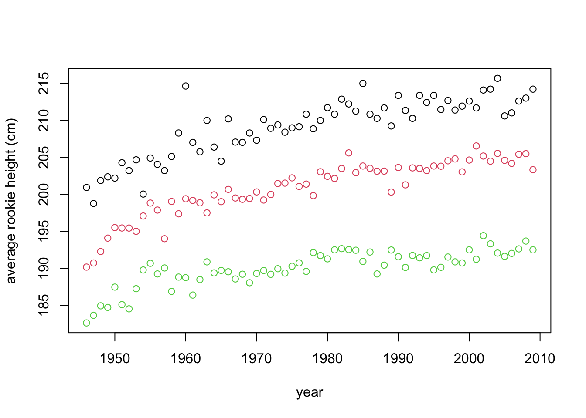
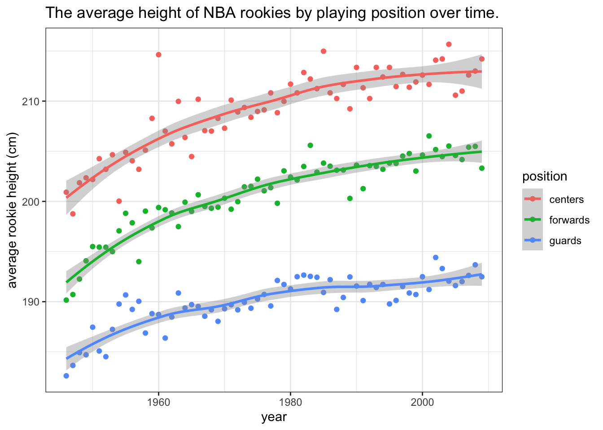
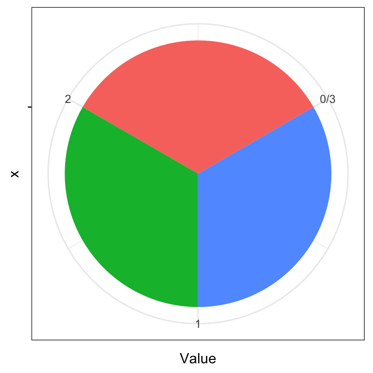
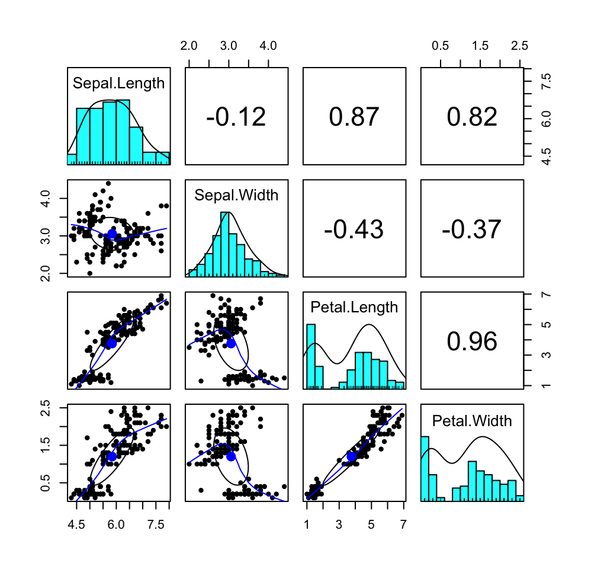

# Summarizing data - visualization {#summarize2}

Data summarization is the science and art of conveying information more effectivelly and efficiently. Data summarization is typically numerical, visual or a combination of the two. It is a key skill in data analysis - we use it to provide insights both to others and to ourselves. Data summarization is also an integral part of exploratory data analysis.

In this chapter we will focus on the basic visualization techniques for univariate and bivariate data. Advanced data summarization techniques will be covered in a later chapter.

We will be using R and ggplot2 but the contents of this chapter are meant to be tool-agnostic. Readers should use the programming language and tools that they are most comfortable with. However, do not sacrifice expresiveness or profesionallism for the sake of convenience - if your current toolbox limits you in any way, learn new tools!

In most examples in this section we'll be using the [NBA players dataset](data/NBAplayers.csv) that contains some basic information about NBA players in the period up to year 2009.


```r
library(ggplot2)
dat <- read.csv("./data/NBAplayers.csv")
dat <- dat[complete.cases(dat),]
dat$height <- dat$h_feet * 30.48 + dat$h_inches * 2.54 # in cm
dat$weight <- dat$weight * 0.4536                      # in kg
summary(dat)
```

```
##     ilkid            firstname           lastname           position        
##  Length:3906        Length:3906        Length:3906        Length:3906       
##  Class :character   Class :character   Class :character   Class :character  
##  Mode  :character   Mode  :character   Mode  :character   Mode  :character  
##                                                                             
##                                                                             
##                                                                             
##   firstseason     lastseason       h_feet         h_inches     
##  Min.   :1946   Min.   :1946   Min.   :5.000   Min.   :-6.000  
##  1st Qu.:1967   1st Qu.:1970   1st Qu.:6.000   1st Qu.: 3.000  
##  Median :1980   Median :1985   Median :6.000   Median : 6.000  
##  Mean   :1979   Mean   :1983   Mean   :6.022   Mean   : 5.581  
##  3rd Qu.:1995   3rd Qu.:2001   3rd Qu.:6.000   3rd Qu.: 8.000  
##  Max.   :2009   Max.   :2009   Max.   :7.000   Max.   :11.500  
##      weight         college           birthdate             height     
##  Min.   : 60.33   Length:3906        Length:3906        Min.   :160.0  
##  1st Qu.: 83.92   Class :character   Class :character   1st Qu.:190.5  
##  Median : 92.99   Mode  :character   Mode  :character   Median :198.1  
##  Mean   : 93.91                                         Mean   :197.7  
##  3rd Qu.:102.06                                         3rd Qu.:205.7  
##  Max.   :149.69                                         Max.   :231.1
```

Visual summaries are often a more informative, faster and more concise alternative to numerical summaries. This will also be our guideline for improving our visualizations. Can we convey the same information in substantially less time/space? Can we convey more information without using more time/space? If the answer is yes, then we should!

We'll illustrate this point with an example that features some common mistakes or inefficiencies people do when visualizing data. Our goal will be to summarize how the average height of NBA Centers, Forwards, and Guards has changed over time. We'll focus on rookies - for each year we'll look at the players that started their NBA career that year.

Let's plot the averages over time:


```r
tmp <- dat[dat$position == "G",]
plot(tapply(tmp$height, tmp$firstseason, mean))
```


```r
tmp <- dat[dat$position == "F",]
plot(tapply(tmp$height, tmp$firstseason, mean))
```


```r
tmp <- dat[dat$position == "C",]
plot(tapply(tmp$height, tmp$firstseason, mean))
```



The plots reveal information that the average height of rookies has been increasing over time for all three groups of players. We should immediately recognize that we are wasting space by plotting each plot separately. We are also wasting the reader's time, having to jump back and forth from one plot to another when making comparisons. So, by plotting all three groups together, we save space and allow the reader to make inter-group comparisons more efficiently.

Remember that how we present our results is how we treat our reader. These kind of plots say to the reader that our time and convenience are more important than theirs.

Let's remedy this mistake:


```r
tmp <- dat[dat$position == "G",]
plot(tapply(tmp$height, tmp$firstseason, mean), col = "green", 
     ylim = c(180, 220))
tmp <- dat[dat$position == "F",]
points(tapply(tmp$height, tmp$firstseason, mean), col = "red")
tmp <- dat[dat$position == "C",]
points(tapply(tmp$height, tmp$firstseason, mean), col = "black")
```


This plot uses up only a third of the space and simplifies comparison. This reveals new information, such as that centers (black) are higher than forwards (red) who are higher than guards (green), that there was a more steep increase in the beginning of the period and that forwards these days are as high on average as centers were in the past.

However, there are several things that we can still improve on. The first will be one of the fundamental rules of statistical plotting - **always label your axes**! The reader should never look elsewhere for information about what is plotted. We will also take this opportunity to reorganize our data:


```r
library(reshape2)
tmp <- melt(tapply(dat$height, list(dat$position, dat$firstseason), mean))
names(tmp) <- c("position", "year", "height")
plot(tmp$year, tmp$height, 
     col = tmp$position, xlab = "year", 
     ylab = "average rookie height (cm)")
```



This is starting to look better. However, we should also include the legend - if we describe the meaning of the colors in the figure caption (or worse, in text), the reader will have to jump from text to figure, wasting time. Additionally, some people (and publications) prefer to add a title to their plot, explaining concisely what is in it, therefore making it more self containes. Others prefer to explain the plot in the caption. We'll add a title:


```r
tmp <- melt(tapply(dat$height, list(dat$position, dat$firstseason), mean))
names(tmp) <- c("position", "year", "height")
plot(tmp$year, tmp$height, col = tmp$position, 
     xlab = "year", ylab = "average rookie height (cm)")
legend(1997, 190, legend=c("centers", "forwards", "guards"),
       col=c("black", "red", "green"), lty = 1, cex=0.8)
title("The average height of NBA rookies by playing position over time.")
```


This is now a quite decent and self-contained plot. Next, we'll add a bit of polish. Pleasing aesthetics might not add much to the informativeness of a plot, but they do make our work look more professional. They are also indicate that we put in the extra effort. Of course, we should never let aesthetics get in the way of efficiency and informativeness (see pie-chart example in the following section):


```r
tmp <- melt(tapply(dat$height, list(dat$position, dat$firstseason), mean))
names(tmp) <- c("position", "year", "height")
levels(tmp$position) <- c("centers", "forwards", "guards")
ggplot(tmp, aes(x = year, y = height, colour = position)) + geom_point() + 
  xlab("year") + ylab("average rookie height (cm)") + 
  ggtitle("The average height of NBA rookies by playing position over time.") +
  theme_bw()
```


By using ggplot2 we can make our visualizations look better, but it is also very convenient for adding some extra layers to our plots. Additional layers are draw on top of eachother, in order. For example, let's add a smoothed line with standard errors to help us focus on the trend and not the individual data points:


```r
tmp <- melt(tapply(dat$height, list(dat$position, dat$firstseason), mean))
names(tmp) <- c("position", "year", "height")
levels(tmp$position) <- c("centers", "forwards", "guards")
ggplot(tmp, aes(x = year, y = height, colour = position)) + 
  geom_point() + geom_smooth(method = "loess") +
  xlab("year") + ylab("average rookie height (cm)") + 
  ggtitle("The average height of NBA rookies by playing position over time.") +
  theme_bw()
```

```
## `geom_smooth()` using formula 'y ~ x'
```



There is one more thing that we can typically do in such cases - label the data directly and omit the legend. Always keep related objects visually close! This saves both space and user's time, especially if we have several lines/colors in our plot:


```r
tmp <- melt(tapply(dat$height, list(dat$position, dat$firstseason), mean))
names(tmp) <- c("position", "year", "height")
levels(tmp$position) <- c("centers", "forwards", "guards")
ggplot(tmp, aes(x = year, y = height, colour = position)) + 
  geom_point(alpha = 0.5) + geom_smooth(method = "loess") +
  xlab("year") + ylab("average rookie height (cm)") + 
  ggtitle("The average height of NBA rookies by playing position over time.") +
  theme_bw() + theme(legend.position = "none") + 
   annotate("text", x = 1970, y = 212, label = "centers", colour = "red") +
  annotate("text", x = 1970, y = 203, label = "forwards", colour = "darkgreen") +
  annotate("text", x = 1970, y = 192, label = "guards", colour = "blue")
```

```
## `geom_smooth()` using formula 'y ~ x'
```

<div class="figure">

<p class="caption">(\#fig:unnamed-chunk-8)The data show that the average heights of all three groups of players have been increasing. The difference between forwards and centers is approximately the same throughout the period while the average height of guards has been increasing at a slower pace. Note that the lines are loess smoothed lines with standard error estimates.</p>
</div>

We've equipped the above plot with a caption that states the information that we would like to point out to the reader (the plot serves as a visual summary and argument). We've also made the points transparent, to put more focus on the lines. There is always something we can tweak and improve in a plot, depending on the situation, but if all of our plots will be at least at the level of this plot, that will be of sufficient standards.

## Histograms and density plots

The most elementary way of summarizing data is to plot their density. Of course, the true density is unknown and we can only estimate it by using a model or a non-parametric (smoothing) kernel density estimation. A histogram (binning the data and plotting the frequencies) can be viewed as a more coarse or discrete way of estimating the density of the data.

In both density plots and histograms we need to specify the amount of smoothing (smoothing kernel width or bin size) - most built-in functions do it for us, but there is no optimal way of doing it, so we can often improve the plot by selecting a more appropriate degree of smoothing. When we have more data, we can get away with less smoothing and reveal more characterisics of the underlying distribution.

We illustrate these two plots by summarizing the NBA players' weight:


```r
ggplot(dat, aes(x = weight)) + geom_histogram(aes(y=..density..), alpha=0.5, 
                position="identity", binwidth = 7) + 
  geom_density(lwd = 1, col = "black") + theme_bw()
```

<div class="figure">

<p class="caption">(\#fig:unnamed-chunk-9)Histogram and density estimation of NBA player weight</p>
</div>

## Bar plot

Bar plots are the most common choice for summarizing the (relative) frequencies for categorical or ordinal data with a manageable number of unique values. It is similar to a histogram, except that the categories/values provide a natural way of binning the data:


```r
set.seed(0)
tmp <- data.frame(University = dat$college)
x <- table(tmp)
x <- x[x >= 5]
x <- sample(x, 10, rep = F)
x <- sort(x)
ggplot(as.data.frame(x), aes(x = University, y = Freq)) + 
  geom_bar(stat = "identity") + coord_flip() +
  xlab("University") + ylab("number of players")
```

<div class="figure">

<p class="caption">(\#fig:unnamed-chunk-10)The number of NBA players that came from these 10 Universities.</p>
</div>

When the number of unique values is large, it will not be not possible to visualize all of them (try visualizing the frequencies for all universities in the above example). In such cases we may opt to group some values or show only certain values.

## Pie chart

Pie charts are quite possibly the easiest chart type to work with, because there is only one rule to using pie charts - **don't use pie charts**. Let's visualize the data from the bar chart example:


```r
y <- x / sum(x)
ggplot(data.frame(y), aes(x = "", y = Freq, fill = University)) + 
  geom_bar(width = 1, stat = "identity") + coord_polar("y", start=0) + theme_bw() + labs(fill = "University")
```

<div class="figure">

<p class="caption">(\#fig:unnamed-chunk-11)The relative frequencies of NBA players that came from these Universities.</p>
</div>

The pie chart is a great example (and warning!) of how aesthetics can get in the way of function and effectiveness. It is well documented that people are poor at comparing areas and especially angles. Could you recognize quickly from the above pie chart that University of Washington gave approximately twice as many players as University of Texas? How quickly would you be able to judge these relationships from the bar chart?

Angles can also play tricks on our eyes. Which color pie slice is the largest on the first plot below? Which on the second plot?


```r
y <- data.frame(Name = c("A", "B", "C"), Value = rep(1, 3))
ggplot(data.frame(y), aes(x = "", y = Value, fill = Name)) + 
  geom_bar(width = 1, stat = "identity") + coord_polar("y", start=0) + theme_bw() + theme(legend.position = "none")
```


```r
ggplot(data.frame(y), aes(x = "", y = Value, fill = Name)) + 
  geom_bar(width = 1, stat = "identity") + coord_polar("y", start=pi/3) + 
  theme_bw() + theme(legend.position = "none")
```



For more information on how people perceive visual objects and relationships between them (distances, angles, areas), we recommend the pioneering work of Cleveland and McGill (see Further reading). Note that while a pie chart (the same applies to donut charts) is arguably a poor chart from a statistical graphics perspective, it is visually appealing and more engaging. That is, the pie chart still has merit as a techinque for visual presentation of information as witnessed by its widespread use.

## Scatterplot

The scatterplot is the most common plot for summarizing the relationship between two numerical variables. In this chapter we've already seen several examples of scatterplots. Here, we use three of them to summarize the relationship between player weight and player height by position.


```r
ggplot(dat, aes(x = height, y = weight)) + geom_jitter(width = 3, alpha = 0.3) + 
  theme_bw() + facet_wrap(.~position)
```

<div class="figure">

<p class="caption">(\#fig:unnamed-chunk-13)Relationship between player weight and height by player position. Note that we introduced a bit of jitter - this is a common approach to dealing with numerical data where we have a limited number of unique values (such as rounded data) to reveal where we have more points.</p>
</div>

## 2D density plot

When individual points are of little interest and we just want to summarize the density of the joint distribution, a 2D density plot is a good alternative to the scatterplot:


```r
ggplot(dat, aes(x = height, y = weight, colour = position)) + 
  geom_density_2d() + theme_bw() + 
  theme_bw() + theme(legend.position = "none") + 
  annotate("text", y = 90, x = 212, label = "centers", colour = "red") +
  annotate("text", y = 80, x = 203, label = "forwards", colour = "darkgreen") +
  annotate("text", y = 73, x = 192, label = "guards", colour = "blue")
```

<div class="figure">

<p class="caption">(\#fig:unnamed-chunk-14)Relationship between player weight and height by player position.</p>
</div>

Density plots should be read as maps - the contours represent points of equal height (in our case, density). Where contour lines lie closer together, we have a steeper hill.

Note that drawing a density plot from a point cloud requires some sort of density estimation or smoothing. Statistical graphics packages typically use non-parameteric smoothing which has at least one relevant parameter with which we can control the amount of smoothing (for example, smoothing kernel width). The default or automatic selection of this parameter gives satisfactory results in most cases, but sometimes we can improve the plot by manually selecting the parameter value.

## Boxplot

The boxes (where the boxplot gets is name) typicaly summarize the quartiles of the data (1st, meadian and 3rd quartile). Sometimes, whiskers are used to represent the IQR (Inter-Quartile Range) and points beyond that range are plotted - the IQR is a common approach to defining what an outlier is.


```r
ggplot(dat, aes(x = position, y = weight)) + geom_boxplot(width = 0.1) + theme_bw()
```

<div class="figure">

<p class="caption">(\#fig:unnamed-chunk-15)Summary of player weight by position.</p>
</div>

## Violin plot

The boxplot shows only the quartiles so it can sometimes hide relevant information and mislead us. An alternative is to plot the entire density estimates. Such a plot is called a violin plot.


```r
ggplot(dat, aes(x = position, y = weight)) + geom_violin(fill = "lightblue") + 
  geom_boxplot(width = 0.05) + theme_bw()
```

<div class="figure">

<p class="caption">(\#fig:unnamed-chunk-16)Summary of player weight by position. Note that we combined the violin plot with the boxplot to facilitate comparison.</p>
</div>

## Correlogram

When we want to quickly inspect if there are any correlations between numerical variables, we can summarize correlation coefficients in a single plot. Such a plot is also known as a correlogram. Here we do it for the iris dataset:


```r
library(ggcorrplot)
corr <- round(cor(iris[,-5]),2)
ggcorrplot(corr, hc.order = TRUE, type = "lower", outline.col = "white", lab = T)
```

<div class="figure">

<p class="caption">(\#fig:unnamed-chunk-17)Summary of the numerical variables in the iris dataset.</p>
</div>

## A comprehensive summary

Sometimes it will be useful to summarize the density/histogram of several numerical variables and the correlation between them. Here is an example of how we can combine histograms/density plots, scatterplots, and information about correlation:


```r
library(psych)
```

```
## 
## Attaching package: 'psych'
```

```
## The following objects are masked from 'package:ggplot2':
## 
##     %+%, alpha
```

```r
pairs.panels(iris[,-5])
```

<div class="figure">

<p class="caption">(\#fig:unnamed-chunk-18)Summary of the numerical variables in the iris dataset.</p>
</div>


## Further reading and references

* This book is a must-read for anyone that aspires to be a professional data analyst: *Tufte, E. R. (2001). The visual display of quantitative information (Vol. 2). Cheshire, CT: Graphics press.*

* To learn more about ggplot2, the go-to plotting library for R users, see: *ggplot2: Elegant Graphics for Data Analysis (Use R!) 1st ed. 2009. Corr. 3rd printing 2010 Edition.*

* The go-to plotting library for Python users is [Matplotlib](https://matplotlib.org/gallery/index.html).

* A great starting point for understanding human perception of graphical representations: *Cleveland, W. S., & McGill, R. (1984). Graphical perception: Theory, experimentation, and application to the development of graphical methods. Journal of the American statistical association, 79(387), 531-554.*

## Learning outcomes

Data science students should work towards obtaining the knowledge and the skills that enable them to:

* Reproduce the techniques demonstrated in this chapter using their language/tool of choice.
* Produce visualizations that are aesthetic and without major techical flaws.
* Recognize when a type of summary is appropriate and when it is not.
* Apply data summarization techiques to obtain insights from data.
* Once introduced to the bootstrap and other estimation techniques, to be able to combine descriptive statistics with a quantification of uncertainty, such as confidence intervals.

## Practice problems

1. Read Chapter 1 of Tufte's book (see Further reading).
2. Gather 3-5 statistical plots from popular media and 3-5 statistical plots from scientific research papers. Comment on if and how each plot could be improved. 
3. Download the [Football Manager Players](data/football-manager-data.zip) dataset or use a similarly rich dataset with numerical, binary and categorical variables. With Python or R demonstrate the application and interpretation of results for each of the visualization techniques from this chapter.
