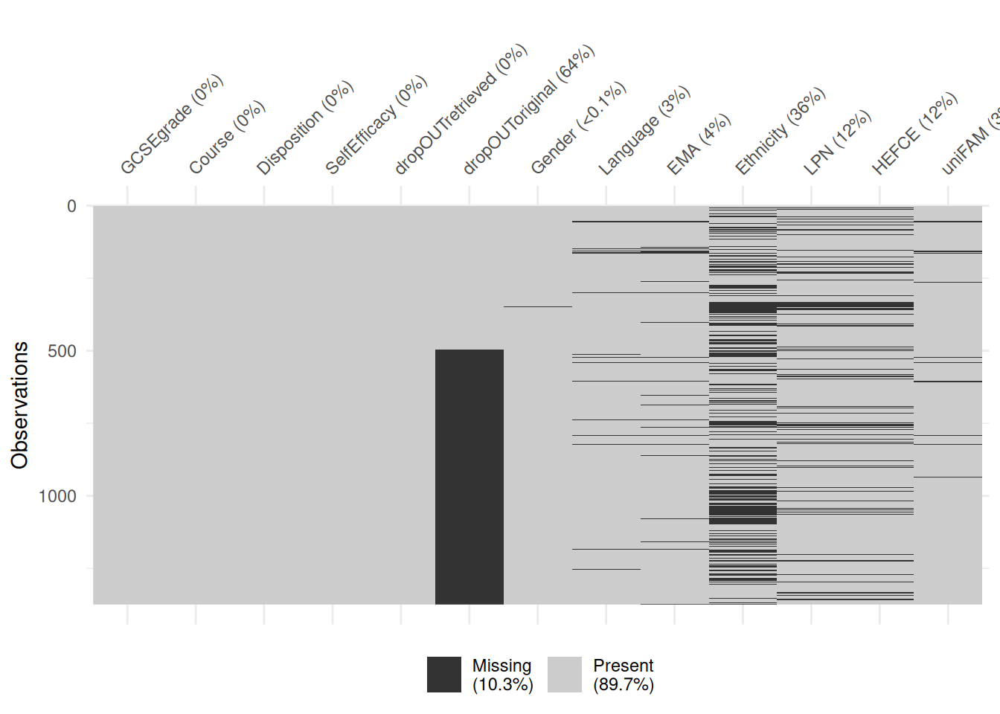
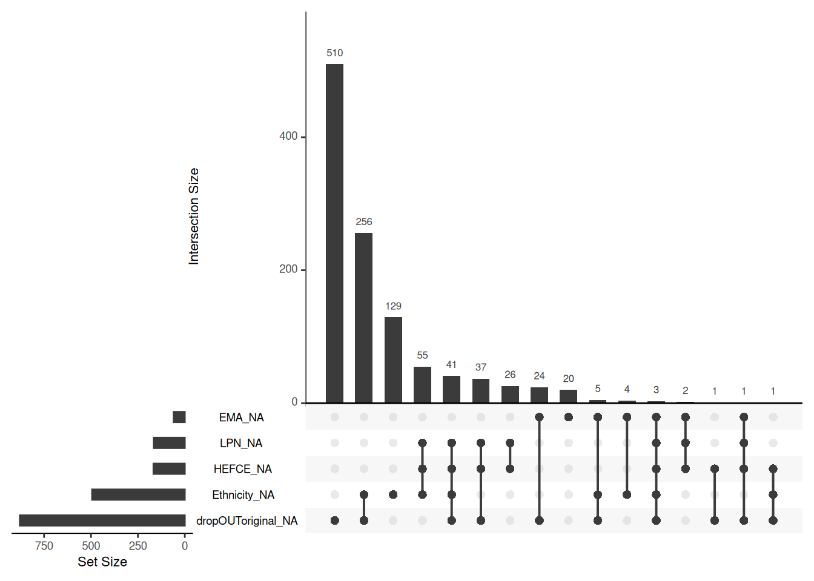

# Dealing with missing data {#missing-data}

In all of our data analyses so far we implicitly assumed that we don't have any missing values in our data. In practice, that is often not the case. While some statistical and machine learning methods work with missing data, many commonly used methods can't, so it is important to learn how to deal with missing values. In this chapter we will discuss a few of the most common methods.

## The severity of the missing data problem

If we judge by the imputation or data removing methods that are most commonly used in practice, we might conclude that missing data is a relatively simple problem that is secondary to the inference, predictive modelling, etc. that are the primary goal of our analysis. Unfortunately, that is not the case. Dealing with missing values is very challenging, often in itself a modelling problem.

### Three classes of missingness {-}

The choice of an appropriate method is inseparable from our understanding of or assumptions about the process that generated the missing values (the *missingness mechanism*). Based on the characteristics of this process we typically characterize the missing data problem as one of these three cases:  

a. **MCAR** (Missing Completely At Random): Whether or not a value is missing is independent of both the observed values and the missing (unobserved) values. For example, if we had temperature measuring devices at different locations and they occassionally and random intervals stopped working. Or, in surveys, where respondents don't respond with a certain probability, independent of the characteristics that we are surveying.

b. **MAR** (Missing At Random): Whether or not a value is missing is independent of the missing (unobserved) values but depends on the observed values. That is, there is a pattern to how the values are missing, but we could fully explain that pattern given only the observed data. For example, if our temperature measuring devices stopped working more often in certain locations than in others. Or, in surveys, if women are less likely to report their weight than men.

c. **MNAR** (Missing Not At Random): Whether or not a value is missing also depends on the missing (unobserved) values in a way that can't be explained by the observed values. That is, there is a pattern to how the values are missing, but we wouldn't be able to fully explain it without observing the values that are missing. For example, if our temperature measuring device had a tendency to stop working when the temperature is very low. Or, in surveys, if a person was less likely to report their salary if their salary was high.

### Determining the missingness mechanism {-}

Every variable in our data might have a different missingness mechanism. So, how do we determine whether it is MCAR, MAR, or MNAR?

Showing with a reasonable degree of certainty that the mechanism is not MCAR is equivalent to showing that the missingness (whether or not a value is missing) can be predicted from observed values. That is, it is a prediction problem and it is sufficient to show *one way* that missingness can be predicted. On the other hand, it is infeasible to show that the mechanism is MCAR, because that would require us to show that there is *no way* of predicting missingness from observed values. We can, however, rule out certain kinds of dependency (for example, linear dependency).

For MNAR, the situation is even worse. In general, it is impossible to determine from the data the relationship between missingness and the value that is missing, because we don't know what is missing. That is, unless we are able to somehow measure the values that are missing, we won't be able to determine whether or not the missingness regime is MNAR. Getting our hands on the missing values, however, is in most cases impossible or infeasible.

To summarize, we'll often be able to show that our missingness regime is not MCAR and never that it is MCAR. Subsequently, we'll often know that the missingness regime is at least MAR, but we'll rarely be able to determine whether it is MAR or MNAR, unless we can get our hands on the missing data. Therefore, it becomes very important to utilize not only data but also domain-specific background knowledge, when applicable. In particular, known relationships between the variables in our data and what caused the values to be missing.

### Causes for missing data {-}

Understanding the cause for missing data can often help us identify the missingness mechanism and avoid introducing a bias. In general, we can split the causes into two classes: *intentional* or *unintentional*. 

Intentionally or systematically missing data are missing by design. For example:

* patients that did not experience pain were not asked to rate their pain,
* a patient that has not been discharged from the hospital doesn't have a 'days spent in hospital care' data point (although we can infer a lower bound from the day of arrival) and
* a particular prediction algorithm's performance was measured on datasets with fewer than 100 variables, due to its time complexity and
* some measurements were not made because it was too costly to make all of them.

Unintentionally missing data were not planned. For example:

* data missing due to measurement error,
* a subject skipping a survey question, 
* a patient prematurely dropping out of a study

and other reasons not planned by and outside the control of the data collector.

There is no general rule and further conclusions can only be made on a case-by-case basis, using domain specific knowledge. Measurement error can range from completly random to completely not-at-random, such a temperature sensor breaking down at high temperatures. Subjects typically do not drop out of studies at random, but that is also a possiblity. When not all measurements are made to reduce cost, they are often omitted completely at random, but sometimes a different design is used.

### Introducing bias {-}

The discussion in this section is very relevant for the remainder of this chapter. It will help us understand the limitations of the methods for dealing with missing data and the consequences of making the wrong choice.

We will discuss two of the most common types of methods - deletion methods and imputation methods. Both types of methods can introduce a bias into our data. That is, they can result in data that are no longer a completely representative (simple random) sample from the process that generated the data and that is the focus of our analysis. This can have an adverse effect on our analysis, regardless of whether we are doing inference, clustering or prediction.

Note that the extent of the bias depends the amount of missingness and the strength of the dependencies, so there is no general rule. Again, we must deal with such problems on a case-by-case basis.

## Visually exploring missingness

Throughout the remainder of the chapter we will be using a dataset from

*Pampaka, M., Hutcheson, G., & Williams, J. (2016). Handling missing data: analysis of a challenging data set using multiple imputation. International Journal of Research & Method in Education, 39(1), 19-37.*

as an illustrative example:


```r
dat <- read.csv("./data/imputationDATASET.csv", stringsAsFactors = T)
summary(dat)
```

```
##      GCSEgrade      Course      Disposition      SelfEfficacy    
##  1_intC   :201   ASTrad:1014   Min.   :-6.840   Min.   :-4.5500  
##  2_higherC: 80   UoM   : 360   1st Qu.: 0.500   1st Qu.: 0.0000  
##  3_intB   :354                 Median : 2.830   Median : 0.5800  
##  4_higherB:353                 Mean   : 2.176   Mean   : 0.7243  
##  5_A      :294                 3rd Qu.: 4.320   3rd Qu.: 1.3500  
##  6_A*     : 92                 Max.   : 4.320   Max.   : 6.0500  
##                                                                  
##  dropOUTretrieved dropOUToriginal    Gender         Language     EMA     
##  no :780          no  :289        female:513   BILINGUAL:273   no  :617  
##  yes:594          yes :206        male  :860   ENGLISH  :985   yes :698  
##                   NA's:879        NA's  :  1   OTHER    : 70   NA's: 59  
##                                                NA's     : 46             
##                                                                          
##                                                                          
##                                                                          
##    Ethnicity     LPN          HEFCE                   uniFAM   
##  ASIAN  :251   NO  :907   Min.   :1.000   firstgeneration:497  
##  BLACK  :105   YES :302   1st Qu.:2.000   parents        :342  
##  CHINESE: 17   NA's:165   Median :3.000   siblings       :499  
##  OTHER  : 58              Mean   :3.843   NA's           : 36  
##  WHITE  :449              3rd Qu.:6.000                        
##  NA's   :494              Max.   :6.000                        
##                           NA's   :167
```

In this analysis, the authors were interested in modelling dropout from mathematics courses (*dropOUToriginal*) which had a lot of missing values. The actual values were later retreived (*dropOUTretrieved*), but we will only use these to verify the quality of our methods.

The other variables include their previous GCSE qualifications results in mathematics (*GCSEgrade*), type of course (*Course*), their disposition to study mathematics at a higher level (*Disposition*), their self-efficacy rating (*SelfEfficacy*), gender, language, whether the student was holding an Educational Maintenance Allowance (*EMA*), ethnicity, whether the student was from Low Participation Neighbourhood (*LPN*), socio-economic status (*HEFCE*) and whether the student was not first generation at HE (*uniFAM*).

If our dataset does not have too many variables, a visual summary such as this one can be very effective at revealing the extend and patterns of missingness in our data:

```r
library(naniar)
vis_miss(dat, warn_large_data = F)
```



Another useful visualization is the frequency of different patterns of missingness:

```r
library(UpSetR)
gg_miss_upset(dat)
```



From the above plot we can see that dropout and ethnicity have the most missing values and that the other most common pattern is for both of them to be missing. If missingness of dropout and ethnicity were independent, we should expect about 64% of missing ethnicity rows to also have missing dropout. That is very likely not the case, as only about a half have missing dropout. That is, there is likely a pattern to missingness.

## Deletion methods

In this section we will cover deletion methods - dealing with missing values by deleting the columns and/or rows that have them.


### Column deletion

The most simple way of dealing with missing values is to delete the column that holds the variable. That is, to remove that variable from all observations.

Such complete removal of potentially useful data is never the optimal choice in terms of available information. And it is not even an option if we are interested in doing inference with/about that variable. In our illustrative example we would, for example, be able to use only the GCSEgrade, Course, Disposition and SelfEfficacy variables to predict dropout.

However, if we have reason to believe that the variable is not practically important for our analysis and/or the fraction of missing values is so large, it might be more easier to just remove the variable. That is, in some cases, the effort of dealing with missing values might outweigh the potential benefits of the extra information.

By removing a variable we of course completely remove all information about the dependency of its (missing) values with other variables. So, regardless of what the missingness mechanism is, we will *not* introduce a bias to our analyses by removing a column. 

### Row deletion

The most common deletion approach is to delete all rows with missing values. If we are not interested in those rows directly and there are not many such rows than this is a completely viable alternative to imputation methods.

However, we must be aware that unless the missingness mechanism is MCAR, we will be introducing a bias into our data. Let's estimate the dropout rate from the data that are available. That is, we remove all rows where we don't know whether the student dropped out or not:


```r
stderr <- function(x) {
  N  <- sum(!is.na(x), na.rm = T)
  sd(x, na.rm = T) / sqrt(N)
}

x  <- dat$dropOUToriginal == "yes"
mu <- mean(x, na.rm = T)
N  <- sum(!is.na(x), na.rm = T)
SE <- stderr(x)
cat(sprintf("%.2f +/- %.3f (n = %d)\n", mu, SE, N))
```

```
## 0.42 +/- 0.022 (n = 495)
```

So, this suggest that we can be reasonably certain that the dropout rate is around 42%. However, this is only valid if the observed values are also a representative sample from our original data (we're assuming that the original data are a representative sample from the population). That will always be the case if the missingness mechanism is MCAR - if missingness is completely random then row deletion will also be completely random.

As we stated at the begining, there is no way of proving that the mechanism is MCAR, however, we can do our best to show that it is not and then account for it. We'll do the latter in the imputation methods section. Here, we just show how incorrect conclusions could be reached if we rely only on row deletion.

Observe that the relative frequency of missing values depends on ethnicity:


```r
x  <- is.na(dat$dropOUToriginal)[dat$Ethnicity == "WHITE"]
mu <- mean(x, na.rm = T)
N  <- sum(!is.na(x), na.rm = T)
SE <- sd(x, na.rm = T) / sqrt(N)
cat(sprintf("==WHITE: %.2f +/- %.3f (n = %d)\n", mu, SE, N))
```

```
## ==WHITE: 0.61 +/- 0.023 (n = 449)
```

```r
x  <- is.na(dat$dropOUToriginal)[dat$Ethnicity != "WHITE"]
mu <- mean(x, na.rm = T)
N  <- sum(!is.na(x), na.rm = T)
SE <- stderr(x)
cat(sprintf("!=WHITE: %.2f +/- %.3f (n = %d)\n", mu, SE, N))
```

```
## !=WHITE: 0.70 +/- 0.022 (n = 431)
```
So, we can be reasonably certain that the missingness mechanism is at least MAR! Now, if those of white ethnicity would be more (less) prone to dropping out, our estimate of 42% from above would underestimate (overestimate) true dropout rate! Before using row deletion, we should check if dropout rate depends on ethnicity:


```r
x  <- (dat$dropOUToriginal == "yes")[dat$Ethnicity == "WHITE"]
mu <- mean(x, na.rm = T)
N  <- sum(!is.na(x), na.rm = T)
SE <- stderr(x)
cat(sprintf("==WHITE: %.2f +/- %.3f (n = %d)\n", mu, SE, N))
```

```
## ==WHITE: 0.45 +/- 0.037 (n = 177)
```

```r
x  <- (dat$dropOUToriginal == "yes")[dat$Ethnicity != "WHITE"]
mu <- mean(x, na.rm = T)
N  <- sum(!is.na(x), na.rm = T)
SE <- stderr(x)
cat(sprintf("!=WHITE: %.2f +/- %.3f (n = %d)\n", mu, SE, N))
```

```
## !=WHITE: 0.43 +/- 0.044 (n = 130)
```

In this case, there is no discernible difference. So, the bias that we might be introducing, is small. Of course, we should do this check for every variable that can reasonably be dependent on/off missigness of dropout!

If the missingness mechanism is MNAR, there is not much we can do. For example, it is not unreasonable to assume that people that dropped out might be less likely to report the dropout information. However, we could not be able to verify if that is the case unless we gathered some of the missing data. Our illustrative example is one of those rare exceptions - the authors gathered the true values hidden behind the missing values, so we can compare:


```r
x  <- dat$dropOUToriginal == "yes"
mu <- mean(x, na.rm = T)
N  <- sum(!is.na(x), na.rm = T)
SE <- stderr(x)
cat(sprintf("ORIGINAL: %.2f +/- %.3f (n = %d)\n", mu, SE, N))
```

```
## ORIGINAL: 0.42 +/- 0.022 (n = 495)
```

```r
x  <- dat[is.na(dat$dropOUToriginal),]$dropOUTretrieved == "yes" 
mu <- mean(x, na.rm = T)
N  <- sum(!is.na(x), na.rm = T)
SE <- stderr(x)
cat(sprintf(" MISSING: %.2f +/- %.3f (n = %d)\n", mu, SE, N))
```

```
##  MISSING: 0.44 +/- 0.017 (n = 879)
```

There is no discernible difference, so, for practical purposes, we'll conclude that the missingness mechanism is MAR and not MNAR.

To summarize this section: row deletion can be useful, but if we are deleting many rows, we should always check if the missingness mechanism is at least MAR and check if we need to account for dependencies between other variables and missingness.

### Pairwise deletion

Pairwise deletion is a special case of row deletion where we delete only the rows with missing values in the variables of interest for a particular part of the analysis. For example, suppose that we are interested in whether or not there is a dependency between dropout, language and ethnicity. First, lets investigate this on the subset of the three columns where we also drop all rows with missing values. We'll use a Chi-squared test (see Basic summarization chapter for details) to test for dependency between the categorical variables:


```r
tmp <- dat[,c(6,8,10)]
tmp <- tmp[complete.cases(tmp),]
cat(sprintf("Rows before = %d, rows after deletion = %d\n", nrow(dat), nrow(tmp)))
```

```
## Rows before = 1374, rows after deletion = 291
```

```r
chisq.test(table(tmp$dropOUToriginal, tmp$Language), simulate.p.value = T)
```

```
## 
## 	Pearson's Chi-squared test with simulated p-value (based on 2000
## 	replicates)
## 
## data:  table(tmp$dropOUToriginal, tmp$Language)
## X-squared = 4.6808, df = NA, p-value = 0.08746
```

```r
chisq.test(table(tmp$dropOUToriginal, tmp$Ethnicity), simulate.p.value = T)
```

```
## 
## 	Pearson's Chi-squared test with simulated p-value (based on 2000
## 	replicates)
## 
## data:  table(tmp$dropOUToriginal, tmp$Ethnicity)
## X-squared = 1.4154, df = NA, p-value = 0.8591
```

```r
chisq.test(table(tmp$Ethnicity, tmp$Language), simulate.p.value = T)
```

```
## 
## 	Pearson's Chi-squared test with simulated p-value (based on 2000
## 	replicates)
## 
## data:  table(tmp$Ethnicity, tmp$Language)
## X-squared = 123.1, df = NA, p-value = 0.0004998
```

So, if we dropped all rows with missing values in any of the three columns, we'd be left with 291 observations. If we instead remove for each pair only the rows that are missing one of those values, we get 474, 307 and 841 observations, respectively. If we had used a 5% risk level, we'd in fact reject the null hypothesis with pairwise deletion but not with row deletion:


```r
tmp <- dat[,c(6,8)]
tmp <- tmp[complete.cases(tmp),]
cat(sprintf("Rows before = %d, rows after deletion = %d\n", nrow(dat), nrow(tmp)))
```

```
## Rows before = 1374, rows after deletion = 474
```

```r
chisq.test(table(tmp$dropOUToriginal, tmp$Language), simulate.p.value = T)
```

```
## 
## 	Pearson's Chi-squared test with simulated p-value (based on 2000
## 	replicates)
## 
## data:  table(tmp$dropOUToriginal, tmp$Language)
## X-squared = 5.8535, df = NA, p-value = 0.04398
```

```r
tmp <- dat[,c(6,10)]
tmp <- tmp[complete.cases(tmp),]
cat(sprintf("Rows before = %d, rows after deletion = %d\n", nrow(dat), nrow(tmp)))
```

```
## Rows before = 1374, rows after deletion = 307
```

```r
chisq.test(table(tmp$dropOUToriginal, tmp$Ethnicity), simulate.p.value = T)
```

```
## 
## 	Pearson's Chi-squared test with simulated p-value (based on 2000
## 	replicates)
## 
## data:  table(tmp$dropOUToriginal, tmp$Ethnicity)
## X-squared = 0.72928, df = NA, p-value = 0.9515
```

```r
tmp <- dat[,c(8,10)]
tmp <- tmp[complete.cases(tmp),]
cat(sprintf("Rows before = %d, rows after deletion = %d\n", nrow(dat), nrow(tmp)))
```

```
## Rows before = 1374, rows after deletion = 841
```

```r
chisq.test(table(tmp$Ethnicity, tmp$Language), simulate.p.value = T)
```

```
## 
## 	Pearson's Chi-squared test with simulated p-value (based on 2000
## 	replicates)
## 
## data:  table(tmp$Ethnicity, tmp$Language)
## X-squared = 285.5, df = NA, p-value = 0.0004998
```

So, pairwise deletion allows us to use more data. Note, however, that all that we've discussed for row deletion also applies to pairwise deletion. And with pairwise deletion, we have to deal with each sub-analysis separately.

## Imputation methods

The alternative to deleting rows or columns with missing values is to replace missing data with a value. When a single value is used, we refer to it as single imputation, when multiple values (a distribution) is used to replace a missing value, we refer to it as multiple imputation. In this section we'll cover some of the most common variants of both single and multiple imputation. 

### Single imputation with the mean

Single imputation with the mean is a simple procedure of replacing all missing values with the mean of the observed values.

Imputation with the mean has the advantage of not introducing a bias automatically - changing all missing values to the mean will not change the sample mean across all variable values. However, similar to deletion methods, if the missingness mechanism is not MCAR, we risk introducing a bias.

Replacing missing values with the median or mode (with categorical variables mode is the only reasonable central tendency) can be more representative of the underlying distribution, but we must be aware that it automatically introduces a bias. That is, we are inserting values that are not the mean and therefore by definition changing the expectation and introducing a bias. Note that for categorical variables we can also treat missing values as a new separate category and procede with inference and prediction - if we specify the model correctly, such data will be sufficient to account for bias, even if the missingness mechanism is MAR.

A major disadvantage of single imputation is that it typically reduces the variance of the variable. Subsequently, it also reduces any covariance of that variable with other variables. Observe how the variability of the HEFCE variable and its correlation with SelfEfficacy reduce after mean imputation:


```r
x  <- dat$HEFCE
mu <- mean(x, na.rm = T)
sd <- sd(x, na.rm = T)
pr <- cor(x, dat$SelfEfficacy, use = "complete.obs")
cat(sprintf("row deletion   : mu = %.3f  sd = %.3f  cor = %.3f \n",  mu, sd, pr))
```

```
## row deletion   : mu = 3.843  sd = 2.011  cor = -0.064
```

```r
x  <- dat$HEFCE
x[is.na(x)] <- mean(x, na.rm = T)
mu <- mean(x, na.rm = T)
sd <- sd(x, na.rm = T)
pr <- cor(x, dat$SelfEfficacy, use = "complete.obs")
cat(sprintf("mean imputation: mu = %.3f  sd = %.3f  cor = %.3f \n",  mu, sd, pr))
```

```
## mean imputation: mu = 3.843  sd = 1.885  cor = -0.060
```

Such underestimation of variability would also transfer to underestimating uncertainty in our predictions or parameter estimates, which is a serious problem if the goal is to understand uncertainty and not just point estimates.

### Single imputation with prediction

A generalization of imputation with the mean is to predict the missing value using all other available data. This translates to a fully fledged predictive modelling problem with all the complexity of model selection, etc.

We demonstrate the approach by using logistic regression to predict missing dropout values from all variables without missing values:


```r
tmp <- dat[,c(1:4, 6)]
mod <- glm(dropOUToriginal ~ ., tmp, family = "binomial")  # prediction model
idx <- is.na(dat$dropOUToriginal)

pre <- ifelse(predict(mod, newdata = tmp, type = "response") > 0.5, "yes", "no") # predicted values
tmp$dropOUToriginal <- ifelse(idx, pre, dat$dropOUToriginal)

# accuracy on missing values, compared to relative freq.
y <- tmp$dropOUToriginal[idx] == dat$dropOUTretrieved[idx]

cat(sprintf("%.2f +/- %.3f\n", mean(y), stderr(y)))
```

```
## 0.65 +/- 0.016
```

```r
round(mean(dat$dropOUTretrieved[idx] == "no"), 2)
```

```
## [1] 0.56
```

```r
# 
```

The predictions are not very accurate, but still above the relative frequency of the mode of dropout (*no*), which is 0.56.

We could take the extra step of imputing the remaining variables with mean/mode and using them in the model as well:


```r
mode <- function(x) {
  ux <- unique(x)
  ux[which.max(tabulate(match(x, ux)))]
}

impute <- function(x) {
  if (is.numeric(x)) {
    return (ifelse(is.na(x), mean(x, na.rm = T), x))
  } else {
    return(ifelse(is.na(x), mode(x[!is.na(x)]), x))
  }
}
tmp <- dat[,-5]
for (i in 1:ncol(tmp)) {
  if (names(tmp)[i] != "dropOUToriginal") tmp[,i] <- impute(tmp[,i])
}

mod <- glm(dropOUToriginal ~ ., tmp, family = "binomial")  # prediction model
idx <- is.na(dat$dropOUToriginal)

pre <- ifelse(predict(mod, newdata = tmp, type = "response") > 0.5, "yes", "no") # predicted values
tmp$dropOUToriginal <- ifelse(idx, pre, dat$dropOUToriginal)

# accuracy on missing values, compared to relative freq.
y <- tmp$dropOUToriginal[idx] == dat$dropOUTretrieved[idx]
cat(sprintf("%.2f +/- %.3f\n", mean(y), stderr(y)))
```

```
## 0.67 +/- 0.016
```

Using the other variables did not lead to an improvement in accuracy. Either there is nothing more we can extract from the given variables or we would need to pick a better model or engineer better input variables.

The advantage of a predictive approach over imputation with mean is that, if we manage to capture the relationships in the data, imputation with a predictive model can account for bias caused by a MAR missingness regime! However, as with any single imputation method, we will still underestimate variability. In order to fully capture variability, we must use a distribution or multiple values - multiple imputation.

### Multiple imputation

The imputation with prediction example from the previous section illustrates how imputation is in itself a prediction problem. Even more, it is potentially a set of many prediction problems, because we have to account for every possible combination of missing values when predicting the missing value of one variable. In the previous example we circumvented that problem by using imputation with mean, but that is not an ideal solution as it underestimates variability. To solve the problem in general, we would have to specify a generative model for all the variables. That is, to specify the data generation process in a way that can be used to generate values for missing data regardless of the pattern of missingness for that observation. This also solves the variability underestimation problem of single imputation - if we have a distribution over all possible missing values, we have a full characterization of the uncertainty or we can generate many datasets which as a whole capture that uncertainty (hence the term *multiple* imputation)

Specifying a full generative model is the most difficult of all modelling problems. A common approach is to use a multivariate normal distribution, because under that modelling assumption all the conditional distributions are also multivariate normal and it is relatively easy to derive their parameters. In R, we can find it implemented in the [amelia](https://cran.r-project.org/web/packages/Amelia/index.html) package. However, this approach can be used out-of-the-box only if all of our data are numerical.

A popular alternative is multiple imputation with chained equations (MICE):

1. First, we specify the type of model we want to use for each type of variable - packages that implement MICE often come with pre-specified models, such as *if numerical, use linear regression*, *if categorical, use logistic regression*, etc.

2. Initially we replace all missing values with some simple procedure, such as mean imputation.

3. We then cycle through all the variables and for each variable use its model from (1) to predict the values of its missing values from all the other variables. After we complete this step, all data that were initially missing values have received new values. We never change the observed values.

4. We repeat (3) for several iterations. We do this to *forget* where we started so that the imputed values reflect the relationships in the data and not the initial, possibly very poor imputation.

This generates one imputed dataset. We repeate steps (2-4) several times to generate multiple imputed datasets. Any further analysis we do should be based on all those datasets, because they capture the variability in the missing data - our uncertainty about what the missing data values might be.

Those familiar with Gibbs sampling, a popular inference algorithm in Bayesian statistics, will quickly recognize that MICE is based on the same ideas. A full generative model can be specified by specifying just the full conditional distributions (a distribution of a variable with all other variables known) and we can use Markov Chain Monte Carlo (in this case Gibbs sampling) to generate samples from the posterior of that model.

Implementations of MICE typically do all the work for us. We only need to specify the number of imputed datasets we need. We'll use the R package [mice](https://cran.r-project.org/web/packages/mice/index.html) to create 50 imputed datasets for our data. We then use logistic regression to predict dropout for each of those datasets and combine the predictions of all the models into a final prediction of dropout. First, we impute the predictor variables:


```r
tmp <- dat[,-c(5,6)]
tgt <- dat$dropOUToriginal

# multiple imputation

library(mice)
```

```
## 
## Attaching package: 'mice'
```

```
## The following object is masked from 'package:stats':
## 
##     filter
```

```
## The following objects are masked from 'package:base':
## 
##     cbind, rbind
```

```r
# Uncomment the lines below to generate tmp data first time
#imputed_tmp <- mice(tmp, m = 50, seed = 0)
#saveRDS(imputed_tmp, "./data/imputed_tmp.rds")

imputed_tmp <- readRDS("./data/imputed_tmp.rds") # we load the precomputed data to save time
```

We can inspect which types of models were used:

```r
print(imputed_tmp$method)
```

```
##    GCSEgrade       Course  Disposition SelfEfficacy       Gender     Language 
##           ""           ""           ""           ""     "logreg"    "polyreg" 
##          EMA    Ethnicity          LPN        HEFCE       uniFAM 
##     "logreg"    "polyreg"     "logreg"        "pmm"    "polyreg"
```

Now we iterate through all the imputed datasets, predict outcome and pool the predictions:

```r
pre <- rep(0, length(x))
for (i in 1:50) {
  df <- complete(imputed_tmp, 1)
  df$tgt <- tgt # add dropout
  mod <- glm(tgt ~ ., df, family = "binomial")
  idx <- is.na(dat$dropOUToriginal)
  pre <- pre + predict(mod, newdata = df, type = "response") / 50
}

pre <- ifelse(pre > 0.5, "yes", "no") # predicted values
tmp$tgt <- ifelse(idx, pre, dat$dropOUToriginal)

# accuracy on missing values, compared to relative freq.
y <- tmp$tgt[idx] == dat$dropOUTretrieved[idx]
cat(sprintf("%.2f +/- %.3f\n", mean(y), stderr(y)))
```

```
## 0.64 +/- 0.016
```

In this case MICE doesn't seem to have helped. In general, MICE is a very robust procedure and it performs really well in many different situations. The main issue with MICE is that it is computationally very intensive.

## Summary

If we are to take away one thing from this chapter it should be that dealing with missing data is not an easy problem. Data will rarely be missing in a *nice* (completely random) way, so if we want to resort to more simple removal or imputation techniques, we must put reasonable effort into determining whether or not the dependencies between observed data and missingness are a cause for concern. If strong dependencies exist and/or there is a lot of data missing, the missing data problem becomes a prediction problem (or a series of prediction problems). We should also be aware of the possibility that missingness depends on the missing value in a way that can't be explained by observed variables. This can also cause bias in our analyses and we will not be able to detect it unless we get our hands on some of the missing values.

Note that in this chapter we focused on standard tabular data. There are many other types of data, such as time-series data, spatial data, images, sound, graphs, etc. The basic principles remain unchanged. We must be aware of the missingness mechanism and introducing bias. We can deal with missing values either by removing observations/variables or by imputing them. However, different, sometimes additional models and techniques will be appropriate. For example, temporal and spatial data lend themselves to interpolation of missing values.

## Further reading and references

* A gentle introduction from a practitioners perspective: Blankers, M., Koeter, M. W., & Schippers, G. M. (2010). Missing data approaches in eHealth research: simulation study and a tutorial for nonmathematically inclined researchers. Journal of medical Internet research, 12(5), e54.

* A great book on basic and some advance techniques: *Allison, P. D. (2001). Missing data (Vol. 136). Sage publications.*

* Another great book with many examples and case-studies: *Van Buuren, S. (2018). Flexible imputation of missing data. Chapman and Hall/CRC.*

* Understanding multiple imputation with chained equations (in R): Buuren, S. V., & Groothuis-Oudshoorn, K. (2010). mice: Multivariate imputation by chained equations in R. Journal of statistical software, 1-68.

* When doing missing data value handling and prediction separately, we should be aware that certain types of prediction models might work better with certain methods for handling missing values. A paper that illustrate this: *Yadav, M. L., & Roychoudhury, B. (2018). Handling missing values: A study of popular imputation packages in R. Knowledge-Based Systems, 160, 104-118.*

## Learning outcomes

Data science students should work towards obtaining the knowledge and the skills that enable them to:

* Reproduce the techniques demonstrated in this chapter using their language/tool of choice.
* Analyze the severity of their missing data problem.
* Recognize when a technique is appropriate and what are its limitations.

## Practice problems

1. We prepared a subset of the [Football Manager Players](data/football-manager-data.zip) dataset that contains 1000 randomly selected 19-year old players, their playing position, height, and 10 other attributes (*[football-manager-complete.rds](data/football-manager-complete.rds)*). We then introduced missing values to this data based on various missingness mechanisms (*[football-manager-missing.rds](data/football-manager-missing.rds)*) and in a way that could also have a reasonable practical explanation. Your task is to:
    a. Identify and, as much as it is possible, characterize missingness mechanisms and patterns in the data.
    b. Use information from (a) to impute missing values in all numerical variables (all variables except *PositionsDesc*, which can be ignored throughout this problem).
    c. Estimate the mean of all numerical variables.
    d. Only once you have completed your analysis, use *football-manager-complete.rds* to compare your estimated means with column averages on the complete dataset. Discuss which mechanisms you correctly detected and characterized. Discuss the discrepancies between your estimates and actual column means - was there anything you could have done better?

2. In the same setting as (1) try to predict players' playing position (*PositionsDesc*) using *football-manager-missing.rds*. once you have completed your analysis, use *football-manager-complete.rds* to evaluate your model on the observations that had missing playing position. Discuss what you could have done better.

