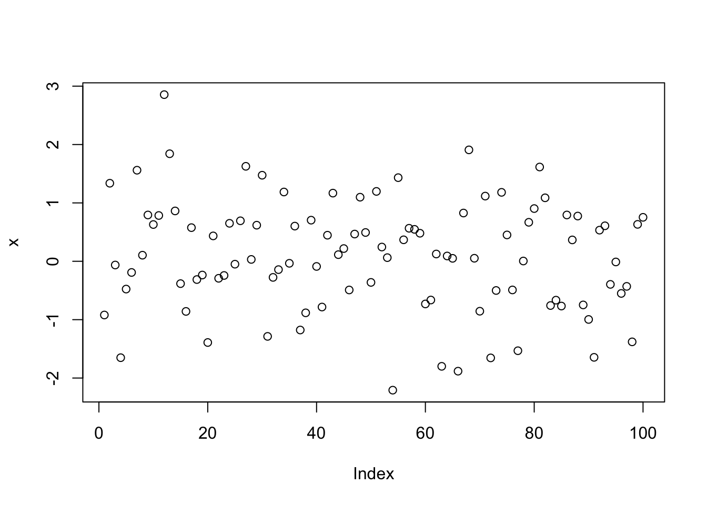

# Other important topics

These are optional, but it would be nice if we can get a visiting lecturer to cover them

* Effective/efficient communication (visual or otherwise)
* Specifics of data science project management


## Testing

\begin{equation*} 
\frac{d}{dx}\left( \int_{a}^{x} f(u)\,du\right)=f(x)
\end{equation*} 

$$\frac{x}{2}$$

\BeginKnitrBlock{theorem}<div class="theorem"><span class="theorem" id="thm:foo"><strong>(\#thm:foo) </strong></span>A labeled theorem here.</div>\EndKnitrBlock{theorem}

See Theorem \@ref(thm:foo)


@R-base

[@R-base]

## R code


```r
x = rnorm(100)
plot(x)
```




## Python code


```r
library(reticulate)
```


```python
print("Hello World")
```

```
## Hello World
```

```python
a = 33
b = 33
if b > a:
  print("b is greater than a")
elif a == b:
  print("a and b are equal")
```

```
## a and b are equal
```
